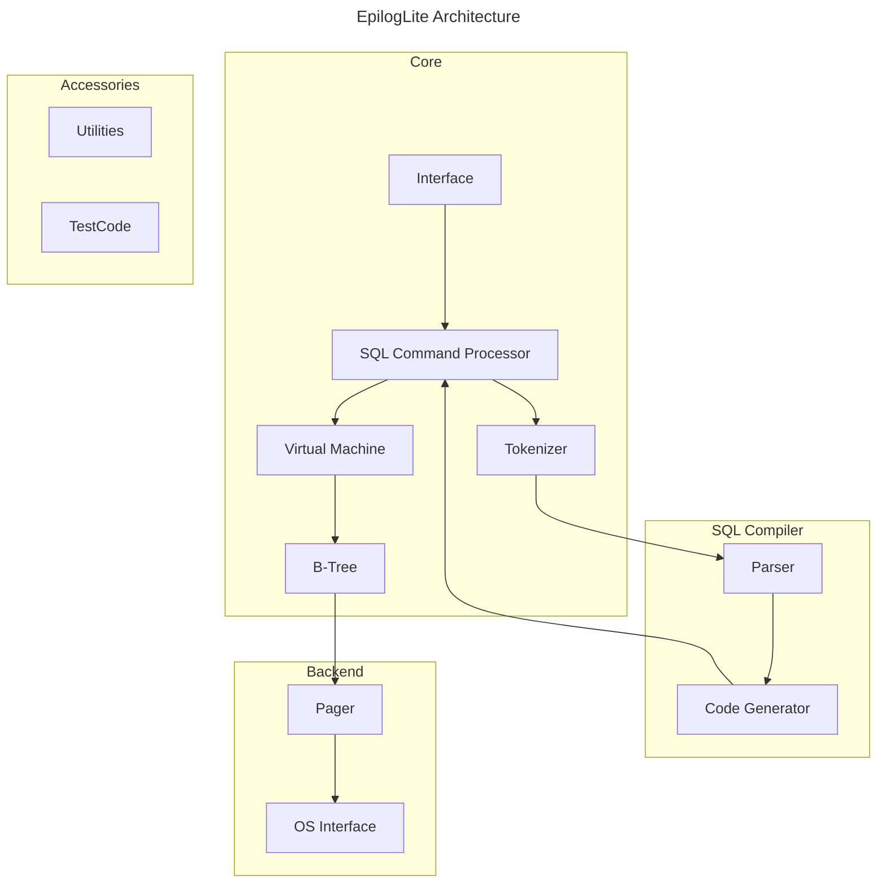

# EpilogLite Architecture

## Introduction

This document describes the architecture of the EpilogLite library crate. The information here is useful to those who want to understand or modify the inner workings of EpilogLite.

EpilogLite works by compiling Structured Query Language ("SQL") text into bytecode, then running that bytecode using a virtual machine.

The `prepare` and related interfaces act as a compiler for a single bytecode program that implements a single SQL statement. The `step` interface passe a bytecode program into the virtual machine, and runs a program until it completes, forms a row of results to be returned, hits a fatal error, or is interrupted.



## High Level Components

### Interface

The public interface is found in the `epiloglite` module. Functions are generally asynchronous. 

### Tokenizer

When a string containing SQL statements is to be evaluated it is first sent to the tokenizer. The tokenizer breaks the SQL text into tokens and passes those tokens to the parser. While this is the reverse of common parser/tokenizer designs, having the tokenizer call the parser is thread safe and runs faster.

### Parser

The parser assigns meaning to tokens based on their context.

### Code Generator

After the semantics have been assigned and a parse tree constructed the code generator translates the tree into bytecode that will perform the work of the SQL statement. The prepared statement structure is a container for this bytecode as well as any state and meta data required. The code generator includes the query planner to try to choose the best algorithm for executing the query.

### Virtual Machine

The bytecode from the code generator is handed off to a virtual machine to be executed. 

### B-Tree

EpilogLite shares on-disk formats with SQLite, using a B-tree implementation. Separate trees are used for each table and index. All of the trees are stored in the same file. Because of the stability of the SQLite file format this implementation should remain compatible.

#### Page Cache

The B-Tree module requests information from the block storage in fixed size pages. The default page size is 4096 bytes, but it can be any power of two between 512 and 65536 bytes. The page cache is responsible for reading, writing, and caching these pages. It also provides the rollback and atomic commit abstractions and handles locking the database file. The b-tree requests particular pages from the page cache when it wants to modify pages, commit, or roll back changes. The page cache handles the details of making sure the requests are handled quickly, safely, and efficiently.

### OS Interface

In order to provide portability across operating systems EpilogLite uses an abstract Virtual File System ("VFS"). The VFS provides methods for finding, opening, creating, modifying, and closing files on block storage. In addition, the OS Interface provides functions for other OS specific tasks, such as finding the current time, and generating randomness. 

### Utilities

Memory allocation, string handling, data type conversion routines, and other utility functions are in the Utilities module. 

## Tests

Tests are implemented in the same file as the components under test, in keeping with the common Rust approach.

```rust
cargo test
```