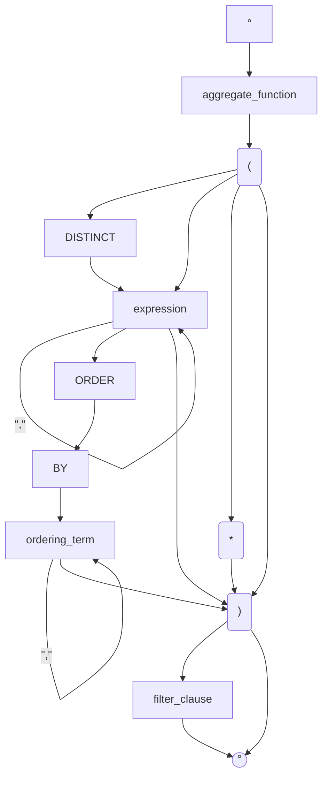

# Aggregate

```mermaid
graph TB
	st["°"]
	lparen("(")
	rparen(")")
	stop(("°"))
	st --> aggregate_function
	aggregate_function --> lparen
	lparen --> DISTINCT
	lparen --> expression
	lparen --> ast("*")
	lparen --> rparen
	DISTINCT --> expression
	expression -->|#quot;,#quot;| expression
	expression --> ORDER
	expression --> rparen
	ORDER --> BY
	BY --> ordering_term
	ordering_term -->|#quot;,#quot;| ordering_term
	ordering_term --> rparen
	ast --> rparen
	rparen --> filter_clause
	rparen --> stop
	filter_clause --> stop
```
