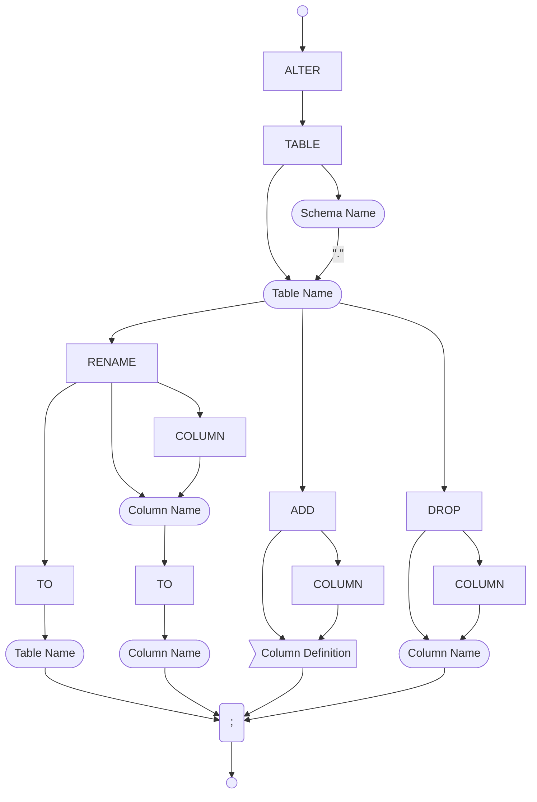

# ALTER TABLE

```mermaid
graph TB
	st(( ))
	semi(;)
	stop(( ))
	semi --> stop
	st --> ALTER
	ALTER --> TABLE
	TABLE --> schema_name([Schema Name])
	TABLE --> table_name([Table Name])
	schema_name -->|#quot;.#quot;| table_name
	table_name --> RENAME
	table_name --> ADD
	table_name --> DROP
	RENAME --> TO
	RENAME --> COLUMN
	RENAME --> column_name([Column Name])
	COLUMN --> column_name
	TO --> new_table_name([Table Name])
	new_table_name --> semi
	column_name --> TO2["TO"]
	TO2 --> new_column_name([Column Name])
	new_column_name --> semi
	ADD --> COLUMN2["COLUMN"]
	ADD --> column_definition>Column Definition]
	COLUMN2 --> column_definition
	column_definition --> semi
	DROP --> COLUMN3["COLUMN"]
	DROP --> column_name2([Column Name])
	COLUMN3 --> column_name2
	column_name2 --> semi
```
