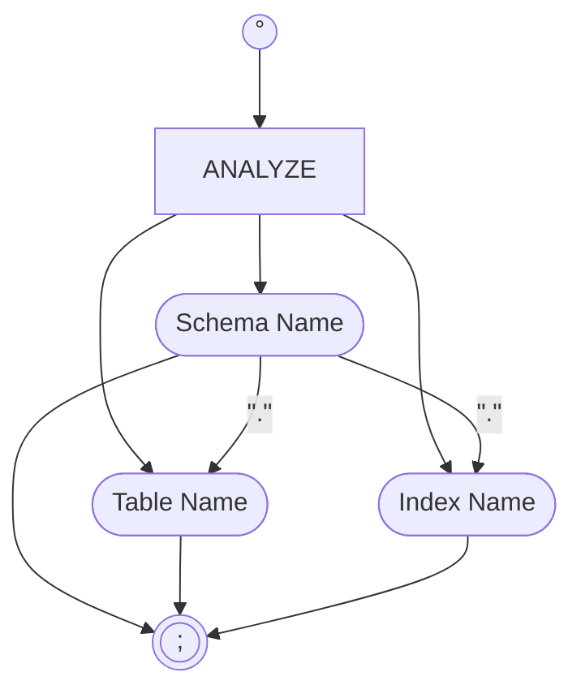

# ANALYZE

```mermaid
graph TB
	st(("°"))
	semi(((";")))
	st --> ANALYZE
	ANALYZE --> schema_name([Schema Name])
	ANALYZE --> index_name([Index Name])
	ANALYZE --> table_name([Table Name])
	schema_name -->|#quot;.#quot;| index_name
	schema_name -->|#quot;.#quot;| table_name
	schema_name --> semi
	table_name --> semi
	index_name --> semi
```
