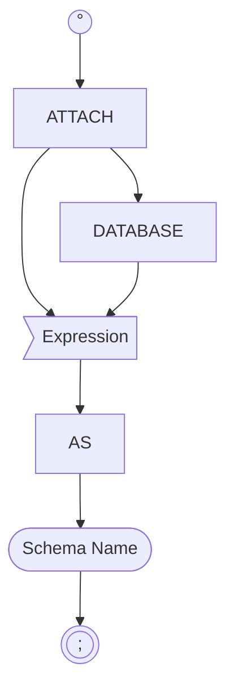

# ATTACH

```mermaid
graph TB
	st(("°"))
	semi(((";")))
	st --> ATTACH
	ATTACH --> DATABASE
	ATTACH --> expression>Expression]
	DATABASE --> expression
	expression --> AS
	AS --> schema_name([Schema Name])
	schema_name --> semi
```
