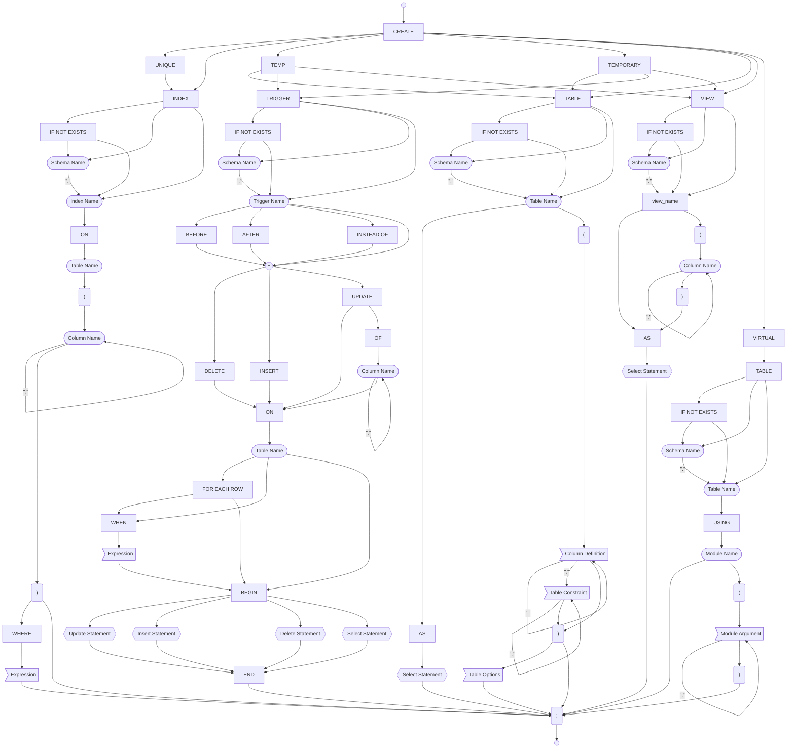

# CREATE

```mermaid
graph TB
	st(( ))
	semi(;)
	stop(( ))
	semi --> stop
	st --> CREATE
	CREATE --> UNIQUE
	CREATE --> INDEX
	UNIQUE --> INDEX
	INDEX --> index_exists[IF NOT EXISTS]
	INDEX --> index_schema_name([Schema Name])
	INDEX --> index_name([Index Name])
	index_exists --> index_schema_name([Schema Name])
	index_exists --> index_name
	index_schema_name -->|#quot;.#quot;| index_name
	index_name --> ON
	ON --> index_table_name([Table Name])
	index_table_name --> index_table_lparen("(")
	index_table_lparen --> index_column_name([Column Name])
	index_column_name -->|#quot;,#quot;| index_column_name
	index_column_name --> index_table_rparen(")")
	index_table_rparen --> WHERE
	index_table_rparen --> semi
	WHERE --> expression>Expression]
	expression --> semi

	CREATE --> TEMP
	CREATE --> TEMPORARY
	CREATE --> TABLE
	TEMP --> TABLE
	TEMPORARY --> TABLE
	TABLE --> table_exists_clause[IF NOT EXISTS]
	TABLE --> table_schema_name([Schema Name])
	TABLE --> table_name([Table Name])
	table_exists_clause --> table_schema_name
	table_exists_clause --> table_name
	table_schema_name -->|#quot;.#quot;| table_name
	table_name --> AS
	table_name --> table_lparen("(")
	AS --> select_statement{{Select Statement}}
	select_statement --> semi
	table_lparen --> column_definition>Column Definition]
	column_definition -->|#quot;,#quot;| column_definition
	column_definition -->|#quot;,#quot;| table_constraint>Table Constraint]
	column_definition --> table_rparen(")")
	table_constraint -->|#quot;,#quot;| table_constraint
	table_constraint --> table_rparen
	table_rparen --> table_options>Table Options]
	table_rparen --> semi
	table_options --> semi

	TEMP --> TRIGGER
	TEMPORARY --> TRIGGER
	TRIGGER --> trigger_exists[IF NOT EXISTS]
	TRIGGER --> trigger_schema_name([Schema Name])
	TRIGGER --> trigger_name([Trigger Name])
	trigger_exists --> trigger_schema_name
	trigger_exists --> trigger_name
	trigger_schema_name -->|#quot;.#quot;| trigger_name
	trigger_name --> BEFORE
	trigger_name --> AFTER
	trigger_name --> instead[INSTEAD OF]
	trigger_name --> j0((+))
	BEFORE --> j0
	AFTER --> j0
	instead --> j0
	j0 --> DELETE
	j0 --> INSERT
	j0 --> UPDATE
	DELETE --> trigger_on[ON]
	INSERT --> trigger_on
	UPDATE --> trigger_on
	UPDATE --> OF
	OF --> update_column_name([Column Name])
	update_column_name -->|#quot;,#quot;| update_column_name
	update_column_name --> trigger_on
	trigger_on --> trigger_table_name([Table Name])
	trigger_table_name --> for_each_row[FOR EACH ROW]
	trigger_table_name --> WHEN
	trigger_table_name --> BEGIN
	for_each_row --> WHEN
	for_each_row --> BEGIN
	WHEN --> trigger_when_expression>Expression]
	trigger_when_expression --> BEGIN
	BEGIN --> update_statement{{Update Statement}}
	BEGIN --> insert_statement{{Insert Statement}}
	BEGIN --> delete_statement{{Delete Statement}}
	BEGIN --> trigger_select_statement{{Select Statement}}
	update_statement --> END
	insert_statement --> END
	delete_statement --> END
	trigger_select_statement --> END
	END --> semi

	TEMP --> VIEW
	TEMPORARY --> VIEW
	CREATE --> VIEW
	VIEW --> view_exists[IF NOT EXISTS]
	VIEW --> view_schema_name([Schema Name])
	VIEW --> view_name
	view_exists --> view_schema_name
	view_exists --> view_name
	view_schema_name -->|#quot;.#quot;| view_name
	view_name --> view_as[AS]
	view_name --> view_lparen("(")
	view_as --> view_select_statement{{Select Statement}}
	view_lparen --> view_column_name([Column Name])
	view_column_name -->|#quot;,#quot;| view_column_name
	view_column_name --> view_rparen(")")
	view_rparen --> view_as
	view_select_statement --> semi

	CREATE --> VIRTUAL
	VIRTUAL --> v_table[TABLE]
	v_table --> v_exists[IF NOT EXISTS]
	v_table --> v_schema_name([Schema Name])
	v_table --> v_table_name([Table Name])
	v_exists --> v_schema_name
	v_exists --> v_table_name
	v_schema_name -->|#quot;.#quot;| v_table_name
	v_table_name --> USING
	USING --> module_name([Module Name])
	module_name --> semi
	module_name --> m_lparen("(")
	m_lparen --> m_argument>Module Argument]
	m_argument -->|#quot;,#quot;| m_argument
	m_argument --> m_rparen(")")
	m_rparen --> semi
```
