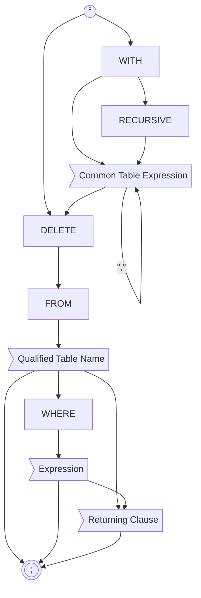

# DELETE

```mermaid
graph TB
	st(("°"))
	semi(((";")))
	st --> WITH
	st --> DELETE
	WITH --> RECURSIVE
	WITH --> common_table_expression
	RECURSIVE --> common_table_expression>Common Table Expression]
	common_table_expression -->|#quot;,#quot;| common_table_expression
	common_table_expression --> DELETE
	DELETE --> FROM
	FROM --> qualified_table_name>Qualified Table Name]
	qualified_table_name --> WHERE
	qualified_table_name --> returning_clause>Returning Clause]
	qualified_table_name --> semi
	WHERE --> expression>Expression]
	expression --> returning_clause
	expression --> semi
	returning_clause --> semi
```
