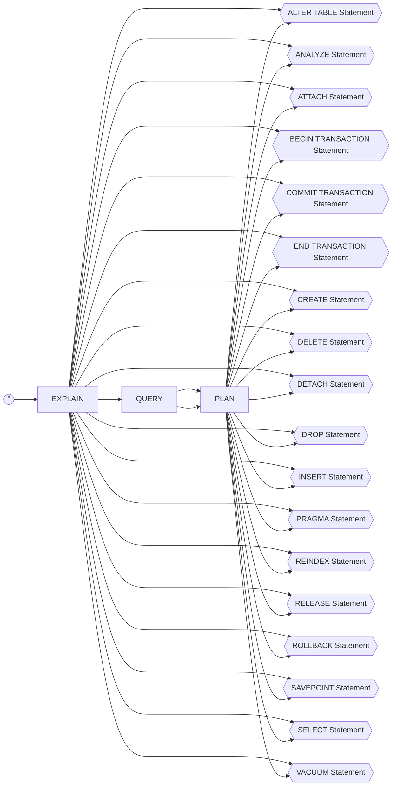

# EXPLAIN

```mermaid
graph LR
	st(("°"))
	st --> EXPLAIN
	EXPLAIN --> QUERY
	QUERY --> PLAN
	EXPLAIN --> alter_table_statement{{ALTER TABLE Statement}}
	EXPLAIN --> analyze_statement{{ANALYZE Statement}}
	EXPLAIN --> attach_statement{{ATTACH Statement}}
	EXPLAIN --> begin_transaction_statement{{BEGIN TRANSACTION Statement}}
	EXPLAIN --> commit_transaction_statement{{COMMIT TRANSACTION Statement}}
	EXPLAIN --> end_transaction_statement{{END TRANSACTION Statement}}
	EXPLAIN --> create_statement{{CREATE Statement}}
	EXPLAIN --> delete_statement{{DELETE Statement}}
	EXPLAIN --> detach_statement{{DETACH Statement}}
	EXPLAIN --> drop_statement{{DROP Statement}}
	EXPLAIN --> insert_statement{{INSERT Statement}}
	EXPLAIN --> pragma_statement{{PRAGMA Statement}}
	EXPLAIN --> reindex_statement{{REINDEX Statement}}
	EXPLAIN --> release_statement{{RELEASE Statement}}
	EXPLAIN --> rollback_transaction_statement{{ROLLBACK Statement}}
	EXPLAIN --> savepoint_statement{{SAVEPOINT Statement}}
	EXPLAIN --> select_statement{{SELECT Statement}}
	EXPLAIN --> vacuum_statement{{VACUUM Statement}}
	QUERY --> PLAN
	PLAN --> alter_table_statement
	PLAN --> analyze_statement
	PLAN --> attach_statement
	PLAN --> begin_transaction_statement
	PLAN --> commit_transaction_statement
	PLAN --> end_transaction_statement
	PLAN --> create_statement
	PLAN --> delete_statement
	PLAN --> detach_statement
	PLAN --> drop_statement
	PLAN --> insert_statement
	PLAN --> pragma_statement
	PLAN --> reindex_statement
	PLAN --> release_statement
	PLAN --> rollback_transaction_statement
	PLAN --> savepoint_statement
	PLAN --> select_statement
	PLAN --> vacuum_statement
```
