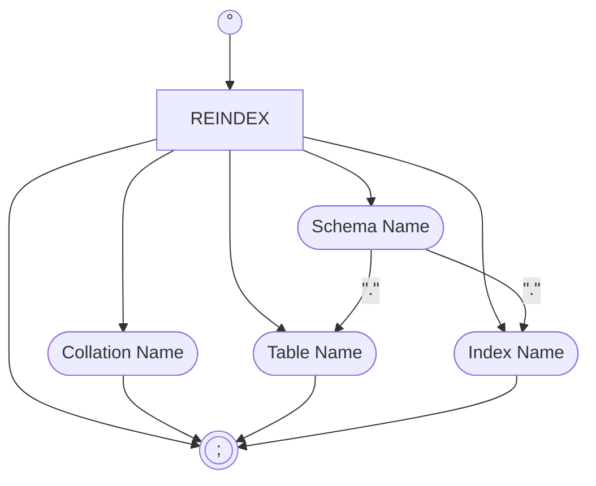

# REINDEX

```mermaid
graph TB
	st(("°"))
	semi(((";")))
	st --> REINDEX
	REINDEX --> semi
	REINDEX --> collation_name([Collation Name])
	REINDEX --> schema_name([Schema Name])
	REINDEX --> table_name([Table Name])
	REINDEX --> index_name([Index Name])
	
	collation_name --> semi
	
	schema_name -->|#quot;.#quot;| table_name
	schema_name -->|#quot;.#quot;| index_name

	table_name --> semi
	index_name --> semi
```
