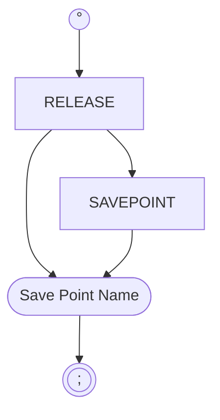

# RELEASE

```mermaid
graph TB
	st(("°"))
	semi(((";")))
	st --> RELEASE
	RELEASE --> SAVEPOINT
	RELEASE --> savepoint_name([Save Point Name])
	SAVEPOINT --> savepoint_name
	savepoint_name --> semi
```
