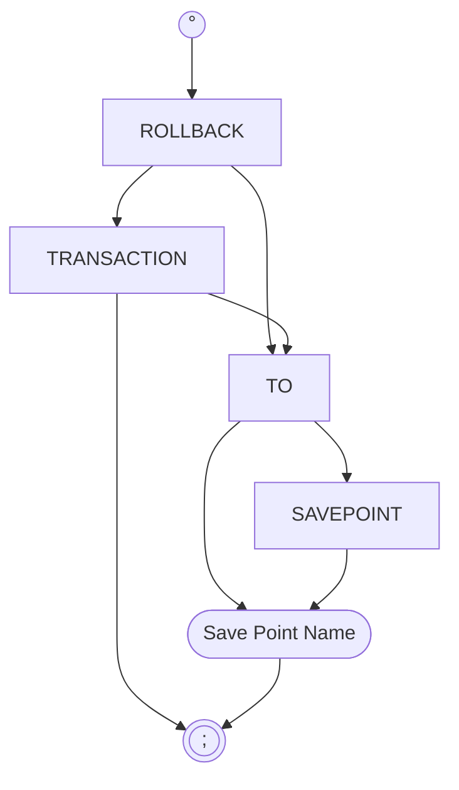

# ROLLBACK TRANSACTION

```mermaid
graph TB
	st(("°"))
	semi(((";")))
	st --> ROLLBACK 
	ROLLBACK --> TRANSACTION
	ROLLBACK --> TO
	TRANSACTION --> TO
	TRANSACTION --> semi
	TO --> SAVEPOINT
	TO --> savepoint_name([Save Point Name])
	SAVEPOINT --> savepoint_name
	savepoint_name --> semi
```
