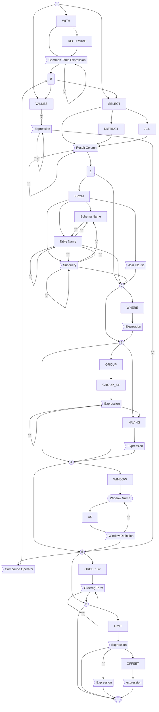

# SELECT

```mermaid
graph TB
	st(("°"))
	semi(((";")))
	st --> WITH
	st --> SELECT
	st --> VALUES
	
	WITH --> RECURSIVE
	WITH --> common_table_expression>Common Table Expression]
	RECURSIVE --> common_table_expression
	
	common_table_expression -->|#quot;,#quot;| common_table_expression 
	common_table_expression --> j0(0)
	
	j0 --> SELECT
	j0 --> VALUES
	
	SELECT --> result_column>Result Column]
	SELECT --> DISTINCT
	SELECT --> ALL
	DISTINCT --> result_column
	ALL --> result_column
	
	result_column -->|#quot;,#quot;| result_column
	result_column --> j1("1")
		
	j1 --> FROM
	j1 --> j2(("2"))
	
	j2 --> WHERE
	j2 --> j3(("3"))
	
	j3 --> GROUP
	j3 --> HAVING
	j3 --> j4(("4"))
	
	j4 --> WINDOW
	j4 --> j5(("5"))
	
	j5 --> compound_operator>Compound Operator]
	j5 --> order_clause[ORDER BY]
	j5 --> j6(("6"))
	
	j6 --> LIMIT
	j6 --> semi
	
	FROM --> from_schema_name[Schema Name]
	FROM --> from_table_name[Table Name]
	FROM --> from_subquery>Subquery]
	FROM --> join_clause>Join Clause]

	from_schema_name -->|#quot;,#quot;| from_table_name

	from_table_name -->|#quot;,#quot;| from_schema_name
	from_table_name -->|#quot;,#quot;| from_table_name
	from_table_name -->|#quot;,#quot;| from_subquery
	from_table_name --> j2

	from_subquery -->|#quot;,#quot;| from_schema_name
	from_subquery -->|#quot;,#quot;| from_table_name
	from_subquery -->|#quot;,#quot;| from_subquery
	from_subquery --> j2

	join_clause --> j2
	
	WHERE --> where_expression>Expression]
	where_expression --> j3
	
	GROUP --> GROUP_BY
	GROUP_BY --> by_expression>Expression]
	by_expression -->|#quot;,#quot;| by_expression
	by_expression --> HAVING
	by_expression --> j4
	
	HAVING --> hav_expression>Expression]
	hav_expression --> j4
	
	WINDOW --> window_name([Window Name])
	window_name --> AS
	AS --> window_definition>Window Definition]
	window_definition -->|#quot;,#quot;| window_name
	window_definition --> j5
	
	VALUES -->|"#quot;(#quot;"| values_expression>Expression]
	values_expression -->|#quot;,#quot;| values_expression
	values_expression -->|"#quot;),(#quot;"| values_expression
	values_expression -->|"#quot;)#quot;"| j5
	
	compound_operator --> j0
	
	order_clause --> ordering_term>Orderng Term]
	ordering_term -->|#quot;,#quot;| ordering_term
	ordering_term --> j6
	
	LIMIT --> limit_expression>Expression]
	limit_expression --> OFFSET
	limit_expression -->|#quot;,#quot;| limit_expression2>Expression]
	limit_expression --> semi
	limit_expression2 --> semi
		
	OFFSET --> offset_expression>expression]
	offset_expression --> semi

```
