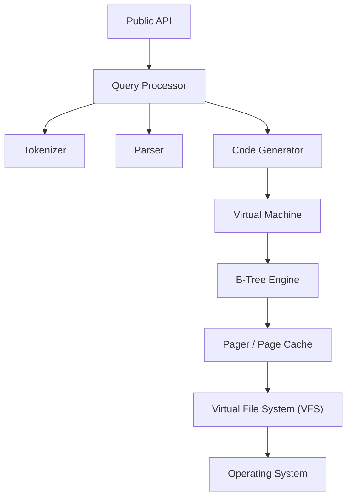

# Overview

## Project Mission

EpilogLite is a Rust implementation of a database engine inspired by SQLite, designed to provide a small, fast, self-contained, high-reliability, full-featured SQL database engine. The project aims to maintain compatibility with the SQLite file format while introducing modern improvements and extensions.

## Goals and Objectives

### Primary Goals

1. **Pure Rust Implementation**: Implement a complete database engine in 100% safe Rust
2. **SQLite Compatibility**: Maintain file format compatibility with SQLite where possible
3. **Modern Architecture**: Leverage Rust's async ecosystem for high-performance concurrent access
4. **Production Quality**: Deliver a robust, well-tested, production-ready database engine
5. **Safety Guarantees**: Provide memory safety and thread safety through Rust's type system

### Secondary Goals

1. Provide a clean, idiomatic Rust API
2. Support modern async/await patterns via Tokio
3. Maintain comprehensive documentation
4. Enable extensibility through clear architectural boundaries
5. Support embedded and no_std environments (future)

## Key Differentiators

EpilogLite is not just a reimplementation of SQLite; it includes significant improvements:

### Safety

- **100% Safe Rust**: No `unsafe` code anywhere in the codebase
- **No unsafe dependencies**: All dependencies must be verified for memory safety
- **Type safety**: Leverage Rust's type system for compile-time guarantees
- **Thread safety**: Safe concurrent access through Rust's ownership model

### Modern Async Architecture

- **Tokio-first design**: Built from the ground up with async in mind
- **Non-blocking I/O**: Async operations as the primary interface
- **Efficient concurrency**: Handle many connections with minimal resource overhead
- **Backpressure control**: Prevent resource exhaustion in high-load scenarios

### Simplified Transaction Model

- **Journal-first COW**: Copy-on-write with journaling for consistency
- **Deterministic recovery**: Recovery process is predictable and well-defined
- **No WAL complexity**: Simplified v1 without Write-Ahead Logging
- **Clear upgrade path**: Architecture supports future WAL addition

## Core Principles

### 1. Safety First

Safety is the top priority. All code must be:

- Free of undefined behavior
- Memory safe through Rust's ownership system
- Thread safe with proper synchronization
- Free from data races and concurrency bugs

### 2. Correctness Over Performance

While performance is important, correctness comes first:

- ACID properties are never compromised
- Data integrity is paramount
- Recovery must be reliable and deterministic
- Test coverage must be comprehensive

### 3. Simplicity and Clarity

The codebase should be:

- Easy to understand and maintain
- Well-documented at all levels
- Modular with clear boundaries
- Consistent in style and approach

### 4. Incremental Development

Development follows a phased approach:

- Each phase has clear deliverables
- Features are fully implemented and tested before moving on
- Regular milestones provide progress tracking
- Community feedback is incorporated iteratively

## Technical Requirements

### Platform Requirements

- **Operating Systems**: Linux, macOS, Windows
- **Rust Version**: Stable Rust (latest stable recommended)
- **Architecture**: 64-bit systems (x86_64, ARM64)

### Runtime Requirements

- **Async Runtime**: Tokio 1.x for async operations
- **Standard Library**: Full `std` support in v1 (`no_std` in future)
- **File System**: POSIX-compliant or Windows file systems

### Dependency Policy

All dependencies must meet the following criteria:

1. **License Compatibility**: Must be compatible with LGPL-3.0-only
2. **Safety**: No `unsafe` code or verified safe `unsafe` usage
3. **Maintenance**: Actively maintained with recent updates
4. **Quality**: Well-tested with good documentation
5. **Necessity**: Must provide clear value and not be easily implementable

## Architecture Overview

EpilogLite is organized into several key layers:

Each layer has well-defined responsibilities and interfaces, enabling modular development and testing.

## Development Roadmap

### Phase I: Engine MVP

Core functionality required for basic database operations:

- [ ] Type system and error handling
- [ ] VFS abstraction layer
- [ ] Page cache and pager
- [ ] B-tree storage engine
- [ ] SQL tokenizer and parser
- [ ] Virtual machine for bytecode execution
- [ ] Basic transaction support

### Phase II: Robustness & Performance

Production-ready features and optimizations:

- [ ] Comprehensive error handling
- [ ] Recovery and crash safety
- [ ] Performance optimization
- [ ] Memory management tuning
- [ ] Query optimization
- [ ] Index support

### Phase III: Cross-platform Testing

Platform compatibility and validation:

- [ ] Linux testing and validation
- [ ] macOS testing and validation
- [ ] Windows testing and validation
- [ ] Performance benchmarking
- [ ] Stress testing
- [ ] Compatibility testing

### Phase IV: Query API & Documentation

Complete API and comprehensive documentation:

- [ ] High-level query API
- [ ] Prepared statements
- [ ] Parameter binding
- [ ] Result set handling
- [ ] API documentation
- [ ] Usage examples
- [ ] Migration guides

## Project Status

**Current Phase**: Phase I (Engine MVP)
**Overall Progress**: ~93% Complete (as tracked in agents/TODO.md)

The core engine is largely complete, with work ongoing for production readiness and comprehensive testing.

## Document Structure

This overview is part of a larger documentation suite:

1. **[Overview](01_Overview.md)** ← You are here
2. **[Architecture Overview](02_Architecture_Overview.md)** - System architecture
3. **[Transaction Model](03_Transaction_Model.md)** - Transaction handling
4. **[Storage and Pages](04_Storage_and_Pages.md)** - Storage format
5. **[Journaling and Recovery](05_Journaling_and_Recovery.md)** - Recovery procedures
6. **[Performance Optimization](06_Performance_Optimization.md)** - Performance details
7. **[Future Extensions](07_Future_Extensions.md)** - Future features

## Getting Started

To start working with EpilogLite:

1. **Read the Documentation**: Start with this overview and the architecture document
2. **Build the Project**: Follow the instructions in the main README
3. **Run the Tests**: Ensure all tests pass on your system
4. **Explore Examples**: Review the examples directory
5. **Contribute**: See CONTRIBUTING.md for contribution guidelines

## Community and Support

- **Repository**: [https://github.com/jeleniel/epiloglite](https://github.com/jeleniel/epiloglite)
- **Issues**: Report bugs and request features via GitHub Issues
- **Discussions**: Ask questions and share ideas via GitHub Discussions
- **Security**: Report security vulnerabilities privately (see SECURITY.md)

## License

EpilogLite is licensed under the GNU Lesser General Public License 3.0 only (LGPL-3.0-only).

This means:

- You can use EpilogLite in your projects (including commercial)
- You must disclose source code for modifications to EpilogLite itself
- You can link to EpilogLite without making your code open source
- Any modifications to EpilogLite must remain under LGPL-3.0-only

See [LICENSE.md](../../LICENSE.md) for the full license text.

## Acknowledgments

EpilogLite is inspired by SQLite, one of the most widely deployed database engines in the world. We are grateful to the SQLite project and its contributors for their pioneering work in embedded databases.

While EpilogLite is an independent implementation in Rust, we strive to maintain compatibility and learn from SQLite's decades of refinement.

---

**Next**: [Architecture Overview](02_Architecture_Overview.md)
