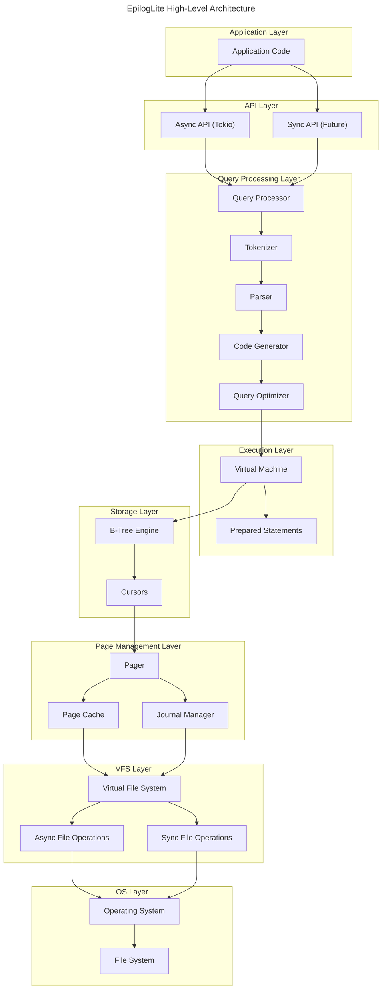
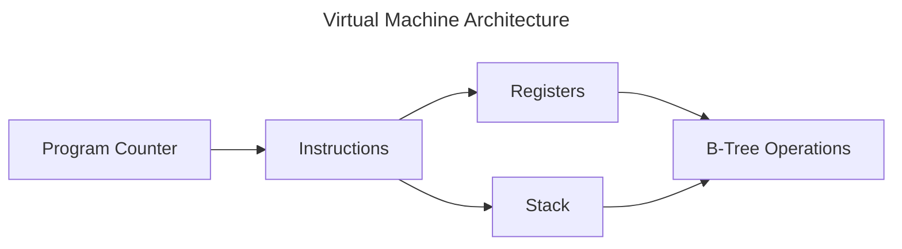
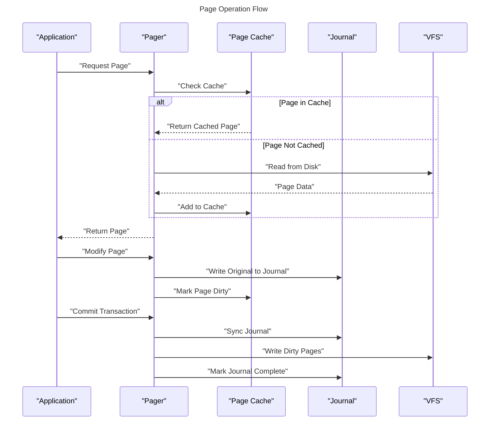
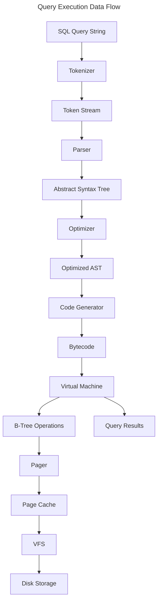
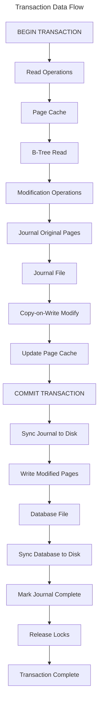
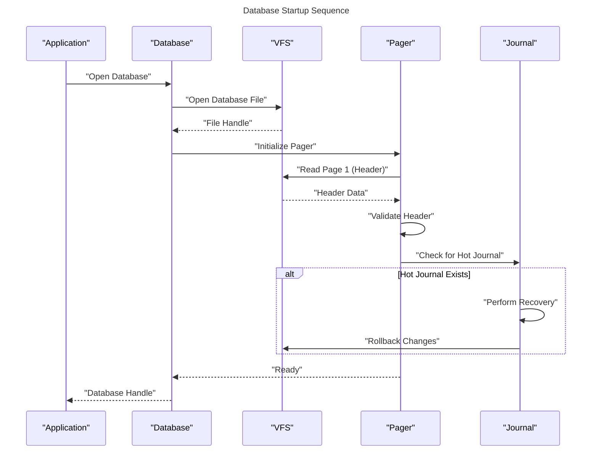

# Architecture Overview

## Introduction

This document describes the high-level architecture of EpilogLite, including the major components, their responsibilities, and how they interact. Understanding this architecture is essential for contributors and anyone seeking to understand or modify the inner workings of EpilogLite.

## High-Level Architecture

EpilogLite follows a layered architecture where each layer has well-defined responsibilities and communicates with adjacent layers through clear interfaces.

## Core Components

### 1. API Layer

The API Layer provides the public interface for applications to interact with EpilogLite.

**Responsibilities:**

- Expose async-first API using Tokio
- Handle database connections
- Manage connection lifecycle
- Provide query execution interface
- Handle result set streaming

**Key Features:**

- Async operations using `async`/`await` syntax
- Connection pooling (future)
- Transaction management API
- Prepared statement support
- Type-safe query parameters

**Future Extensions:**

- Synchronous API for non-async applications
- Connection pooling for multi-threaded access
- Advanced transaction isolation levels

### 2. Query Processing Layer

The Query Processing Layer transforms SQL text into executable bytecode.

#### 2.1 Tokenizer

**Responsibilities:**

- Break SQL text into tokens
- Recognize keywords, operators, and literals
- Handle string escaping and special characters
- Support case-insensitive keyword matching

**Implementation:**

- Uses the Logos lexer generator
- Defines 100+ SQL keywords
- Supports all standard SQL operators
- Handles comments (single-line and multi-line)

#### 2.2 Parser

**Responsibilities:**

- Build Abstract Syntax Tree (AST) from tokens
- Validate SQL syntax
- Assign semantic meaning to tokens
- Handle operator precedence
- Support subqueries and CTEs

**Implementation:**

- Recursive descent parser
- Comprehensive AST node types
- Error recovery for better diagnostics
- Support for complex expressions

#### 2.3 Code Generator

**Responsibilities:**

- Transform AST into bytecode
- Optimize code generation
- Handle expression evaluation
- Generate efficient bytecode sequences

**Implementation:**

- Bytecode instruction set
- Register-based VM architecture
- Constant folding optimizations
- Dead code elimination

#### 2.4 Query Optimizer

**Responsibilities:**

- Choose optimal execution strategies
- Reorder operations for efficiency
- Select appropriate indexes
- Estimate query costs

**Implementation:**

- Rule-based optimizations
- Cost-based query planning
- Index selection algorithms
- Join order optimization

### 3. Execution Layer

The Execution Layer runs the generated bytecode to produce query results.

#### 3.1 Virtual Machine

**Responsibilities:**

- Execute bytecode instructions
- Manage execution context
- Handle control flow
- Perform arithmetic and logical operations
- Invoke storage operations

**Architecture:**

**Key Features:**

- Register-based architecture
- Efficient instruction dispatch
- Minimal memory allocation
- Safe error handling

#### 3.2 Prepared Statements

**Responsibilities:**

- Cache compiled bytecode
- Bind parameters efficiently
- Reset execution state
- Reuse execution plans

### 4. Storage Layer

The Storage Layer manages the persistent storage of data using B-tree structures.

#### 4.1 B-Tree Engine

**Responsibilities:**

- Implement B-tree data structure
- Support table and index trees
- Handle tree balancing
- Manage tree nodes

**Key Operations:**

- Insert: Add new entries
- Delete: Remove entries
- Search: Find entries by key
- Update: Modify existing entries
- Iterate: Traverse tree in order

**Tree Types:**

- **Table B-Trees**: Store row data with integer row IDs
- **Index B-Trees**: Store index entries with pointers to rows

#### 4.2 Cursors

**Responsibilities:**

- Navigate B-tree structures
- Maintain position in tree
- Support bidirectional traversal
- Handle concurrent access

### 5. Page Management Layer

The Page Management Layer handles the in-memory representation and persistence of database pages.

#### 5.1 Pager

**Responsibilities:**

- Read pages from disk
- Write pages to disk
- Manage page lifecycle
- Coordinate with journal
- Handle page locking

**Page Operations:**

#### 5.2 Page Cache

**Responsibilities:**

- Cache frequently accessed pages
- Implement LRU eviction strategy
- Track dirty pages
- Manage memory usage
- Self-tune cache size

**Cache Strategy:**

- Auto-tuning based on workload
- Configurable maximum size
- Efficient page lookup (HashMap)
- Minimal lock contention

**Page Structure:**

All pages in EpilogLite use an identical format:

- `page_id`: Unique page identifier (u32)
- `container_id`: Container (table/index) identifier (u32)
- `crc`: Cyclic redundancy check for integrity (u32)
- `slot_index`: Slot index for page content organization (u16)
- `payload`: Variable-length page content (Vec<u8>)

#### 5.3 Journal Manager

**Responsibilities:**

- Implement journal-first COW protocol
- Write original pages before modification
- Support atomic commits
- Enable crash recovery
- Manage journal lifecycle

**Journal-First COW Cycle:**

1. **Journal**: Write original page content to journal
2. **COW**: Copy-on-write modification in memory
3. **Commit**: Write modified pages to database
4. **Mark**: Mark journal as complete

### 6. VFS Layer

The VFS (Virtual File System) Layer abstracts operating system specific file operations.

#### 6.1 Virtual File System Trait

**Responsibilities:**

- Abstract file operations
- Support multiple backends
- Enable platform portability
- Provide async and sync interfaces

**Operations:**

- Open, close, delete files
- Read, write, seek operations
- File locking (shared, exclusive)
- Sync to disk (fsync)
- File metadata queries

#### 6.2 Async File Operations

**Responsibilities:**

- Non-blocking file I/O
- Integration with Tokio runtime
- Efficient concurrent access
- Backpressure control

**Key Features:**

- Tokio-based async I/O
- Semaphore-based backpressure
- Zero-copy where possible
- Cancellation safety

#### 6.3 Sync File Operations (Future)

**Responsibilities:**

- Blocking file I/O for non-async contexts
- Simple API for CLI tools
- Compatibility with traditional code

### 7. OS Layer

The OS Layer provides the interface between the VFS and the actual operating system.

**Responsibilities:**

- Platform-specific implementations
- Handle OS differences
- Provide uniform abstractions
- Manage system resources

**Supported Platforms:**

- Linux (full support)
- macOS (full support)
- Windows (full support)
- Embedded systems (future, via `no_std`)

## Data Flow

### Query Execution Flow

### Transaction Flow

## Component Interactions

### Startup Sequence

## Development Phases and Status

### Phase I: Engine MVP

- [x] Type system and error handling
- [x] VFS abstraction (async and sync)
- [x] Page cache implementation
- [x] B-tree storage engine basics
- [x] SQL tokenizer
- [x] SQL parser for basic statements
- [x] Code generator basics
- [x] Virtual machine interpreter
- [ ] Complete transaction support
- [ ] Journal-first COW implementation

### Phase II: Robustness & Performance

- [ ] Comprehensive error handling throughout
- [ ] Full crash recovery implementation
- [ ] Query optimizer implementation
- [ ] Index support (B-tree indexes)
- [ ] Memory management tuning
- [ ] Performance profiling and optimization
- [ ] Stress testing suite

### Phase III: Cross-platform Testing

- [ ] Linux platform testing
- [ ] macOS platform testing
- [ ] Windows platform testing
- [ ] Performance benchmarking across platforms
- [ ] Compatibility testing with SQLite files
- [ ] Long-running stability tests

### Phase IV: Query API & Documentation

- [ ] High-level query API design
- [ ] Prepared statement interface
- [ ] Parameter binding API
- [ ] Result set streaming
- [ ] Comprehensive API documentation
- [ ] Tutorial and examples
- [ ] Migration guide from SQLite

## Design Patterns

### Layered Architecture

Each layer depends only on the layer below it, ensuring clean separation of concerns and testability.

### Async-First Design

All I/O operations are async by default, with sync wrappers planned for the future.

### Trait-Based Abstraction

Key interfaces (VFS, File, etc.) are defined as traits, enabling:

- Easy testing with mock implementations
- Platform-specific optimizations
- Alternative storage backends

### Zero-Copy Where Possible

Minimize data copying to improve performance:

- Reference counting for shared data
- Slice-based operations
- Memory-mapped I/O (future)

## Testing Strategy

### Unit Tests

- Each module includes comprehensive unit tests
- Test coverage goal: >80%
- Tests focus on correctness first

### Integration Tests

- Test component interactions
- Verify transaction semantics
- Test recovery scenarios

### Crash Tests

- Simulate power failures
- Verify recovery correctness
- Test journal integrity

### Performance Tests

- Benchmark critical paths
- Regression testing
- Compare with SQLite baseline

## Future Architectural Enhancements

The architecture is designed to support future extensions:

- **Write-Ahead Logging (WAL)**: Alternative to journal-first COW
- **Multi-Connection Support**: Concurrent database access
- **Encryption**: Transparent database encryption
- **Replication**: Master-slave replication
- **Distributed Transactions**: Two-phase commit
- **Plugin System**: Extensible architecture

---

**Previous**: [Overview](01_Overview.md) | **Next**: [Transaction Model](03_Transaction_Model.md)
