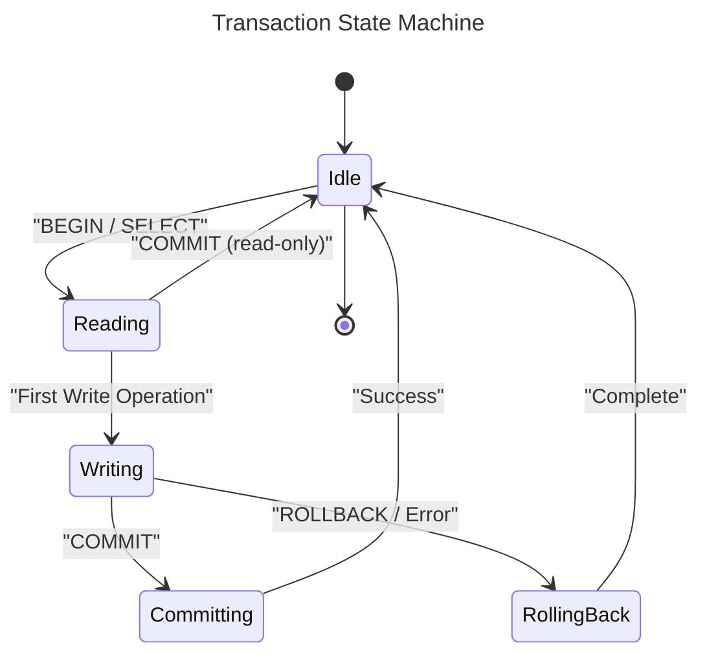
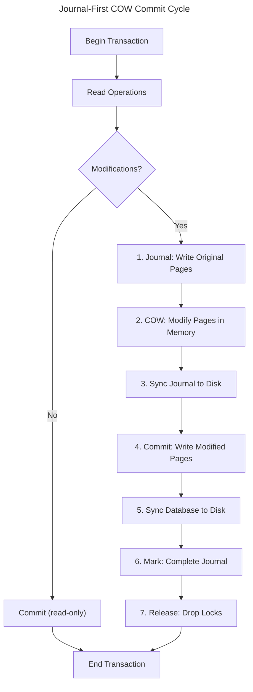
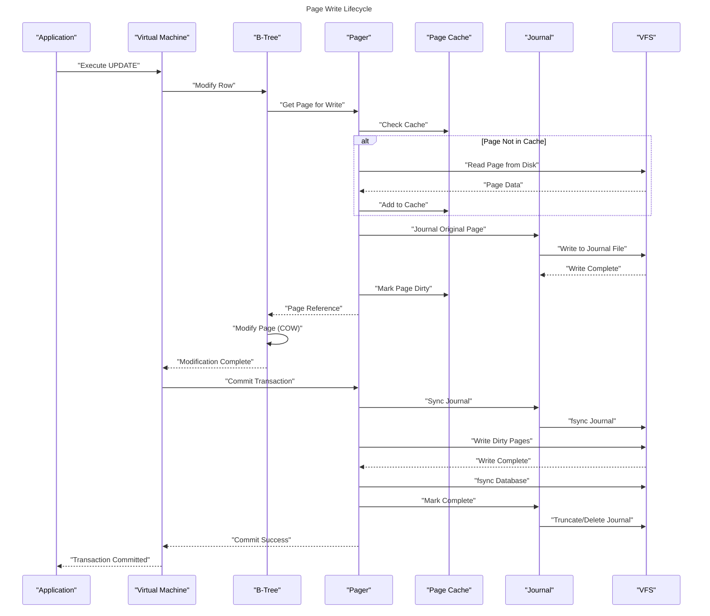
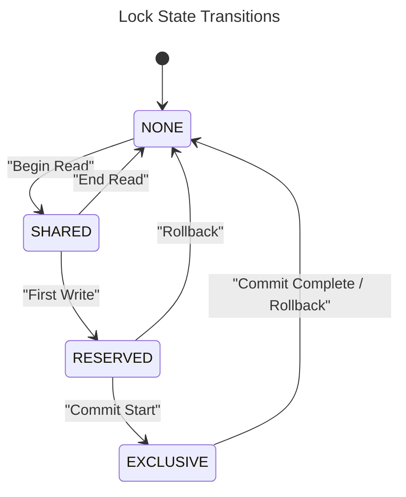
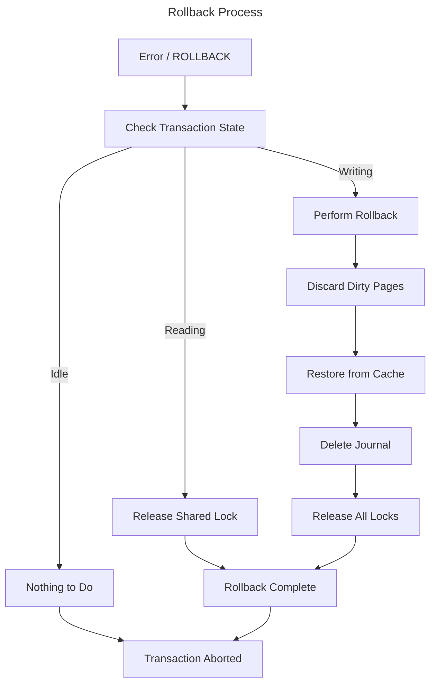
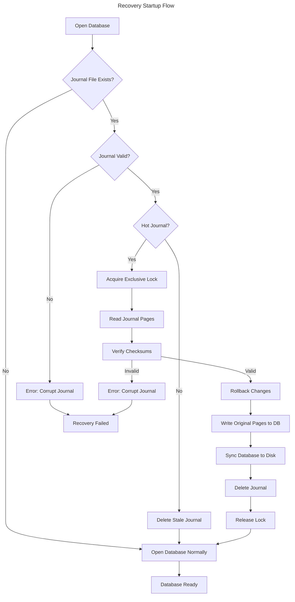

# Transaction Model

## Introduction

This document describes the transaction model used by EpilogLite, including the commit cycle, consistency guarantees, and recovery procedures. EpilogLite's transaction model is designed to provide ACID (Atomicity, Consistency, Isolation, Durability) guarantees while maintaining simplicity and performance.

## ACID Properties

EpilogLite guarantees the following ACID properties:

### Atomicity

Transactions are all-or-nothing operations. Either all changes within a transaction are applied, or none of them are. This is achieved through the journal-first copy-on-write (COW) mechanism.

### Consistency

The database transitions from one consistent state to another. Constraints are checked and enforced before committing changes.

### Isolation

EpilogLite currently provides a simplified isolation model:

- **Single-connection model in v1**: Only one writer at a time
- **Read-committed isolation**: Readers see committed data
- **No dirty reads**: Uncommitted changes are not visible to other connections

Future versions may support additional isolation levels with multi-connection support.

### Durability

Once a transaction commits, the changes are permanent and survive crashes or power failures. This is guaranteed through:

- Synchronous journal writes before database modifications
- fsync operations at critical points
- Deterministic recovery from journals

## Transaction Lifecycle

### Transaction States



### State Descriptions

1. **Idle**: No active transaction, no locks held
2. **Reading**: Shared lock held, reading data
3. **Writing**: Reserved lock held, modifications in progress
4. **Committing**: Exclusive lock held, writing changes to disk
5. **RollingBack**: Restoring original state from journal

## Journal-First Copy-on-Write (COW) Commit Cycle

EpilogLite uses a journal-first COW mechanism for atomic commits. This is a simplified approach compared to SQLite's rollback journal or WAL modes, designed for single-connection use in v1.

### Commit Cycle Overview



### Detailed Commit Steps

#### Step 1: Journal - Write Original Pages

Before modifying any page, the original content is written to the journal file.

**Operations:**

1. Open or create journal file
2. Write journal header with metadata
3. For each page to be modified:
	+ Write page number
	+ Write original page content
	+ Write page checksum
4. Update journal page count

**Journal File Structure:**

```text
+------------------+
| Journal Header   |  (magic, page count, CRC)
+------------------+
| Page 1 Number    |
| Page 1 Content   |
| Page 1 Checksum  |
+------------------+
| Page 2 Number    |
| Page 2 Content   |
| Page 2 Checksum  |
+------------------+
| ...              |
+------------------+
```

**Safety:**

- Journal writes use synchronous I/O
- Each page entry includes a checksum
- Page count is updated only after all pages are written

#### Step 2: COW - Modify Pages in Memory

After journaling, pages are modified in the page cache using copy-on-write semantics.

**Operations:**

1. Mark page as dirty in cache
2. Modify page content in place
3. Update page checksum
4. Track modified pages for commit

**Memory Safety:**

- No unsafe code in page modification
- Rust's borrow checker ensures correctness
- Type-safe page operations

#### Step 3: Sync Journal to Disk

Before writing to the database file, ensure the journal is fully synchronized to disk.

**Operations:**

1. fsync journal file
2. Verify all writes completed
3. On failure, abort transaction

**Critical Guarantee:**

This step ensures that if a crash occurs during database writes, we can recover the original state from the journal.

#### Step 4: Commit - Write Modified Pages

Write all modified pages from the page cache to the database file.

**Operations:**

1. For each dirty page:
	+ Seek to page position
	+ Write page content
	+ Update in-memory state
2. Update database header if needed

**Ordering:**

- Pages can be written in any order
- Each page write is independent
- Partial writes are recovered from journal

#### Step 5: Sync Database to Disk

Synchronize all database writes to disk.

**Operations:**

1. fsync database file
2. Ensure all changes are durable
3. On failure, recovery will use journal

#### Step 6: Mark - Complete Journal

Mark the journal as complete, indicating successful commit.

**Operations:**

1. Truncate journal to zero length, or
2. Zero out journal header, or
3. Delete journal file

**Commit Point:**

This is the actual commit point. Once the journal is marked complete:

- The transaction is committed
- Changes are visible to future transactions
- Recovery will not roll back these changes

#### Step 7: Release - Drop Locks

Release all locks and clean up transaction state.

**Operations:**

1. Release exclusive lock
2. Clear dirty page flags
3. Update connection state to idle
4. Allow other connections to proceed

## Page Write Lifecycle



## Locking Protocol

EpilogLite uses a simplified locking protocol suitable for single-connection access in v1.

### Lock Types

1. **No Lock (NONE)**: No access to database
2. **Shared Lock (SHARED)**: Can read, multiple readers allowed
3. **Reserved Lock (RESERVED)**: Intends to write, one reserved lock allowed
4. **Exclusive Lock (EXCLUSIVE)**: Can write, no other locks allowed

### Lock Transitions



### Lock Acquisition Rules

1. **Shared to Reserved**: Can upgrade if no exclusive lock
2. **Reserved to Exclusive**: Must wait for all shared locks to clear
3. **Exclusive to None**: Release all locks on commit/rollback

### Lock Compatibility Matrix

|             | NONE | SHARED | RESERVED | EXCLUSIVE |
|-------------|------|--------|----------|-----------|
| **NONE**    | ✓    | ✓      | ✓        | ✓         |
| **SHARED**  | ✓    | ✓      | ✓        | ✗         |
| **RESERVED**| ✓    | ✓      | ✗        | ✗         |
| **EXCLUSIVE**| ✓   | ✗      | ✗        | ✗         |

## Transaction Isolation

### Read-Committed Isolation (v1)

EpilogLite v1 provides read-committed isolation:

**Guarantees:**

- No dirty reads: Only committed data is visible
- No lost updates: Writes are serialized
- Simple reasoning: Single writer model

**Non-Guarantees:**

- Non-repeatable reads: Data may change between reads
- Phantom reads: New rows may appear

**Example:**

```sql
-- Transaction 1
BEGIN;
SELECT * FROM users WHERE id = 1;  -- Sees committed data
-- Time passes, another transaction commits changes
SELECT * FROM users WHERE id = 1;  -- May see different data
COMMIT;
```

### Future Isolation Levels

Future versions with multi-connection support may provide:

- **Repeatable Read**: Consistent snapshot within transaction
- **Serializable**: Full serializability guarantees
- **Snapshot Isolation**: MVCC-based isolation

## Error Handling and Rollback

### Automatic Rollback

Transactions are automatically rolled back on:

1. **Application Errors**: Constraint violations, type errors
2. **System Errors**: Disk full, I/O errors
3. **Explicit Rollback**: User-issued ROLLBACK command

### Rollback Process



### Savepoints (Future)

Future versions may support savepoints for partial rollback:

```sql
BEGIN;
-- Some operations
SAVEPOINT sp1;
-- More operations
ROLLBACK TO sp1;  -- Undo only after savepoint
COMMIT;
```

## Crash Recovery

### Hot Journal Detection

On database open, EpilogLite checks for a "hot journal" - a journal file indicating an incomplete transaction.

**Hot Journal Criteria:**

1. Journal file exists
2. Journal file is not empty
3. Journal header is valid
4. No reserved lock on database (indicates crash, not active transaction)

### Recovery Process



### Recovery Guarantees

EpilogLite provides deterministic recovery:

1. **Complete Recovery**: All committed transactions are preserved
2. **No Partial Commits**: Incomplete transactions are fully rolled back
3. **No Data Loss**: Committed data is never lost
4. **Predictable State**: Database is in a known good state after recovery

### Recovery Scenarios

#### Scenario 1: Crash Before Journal Sync

**State:**

- Journal partially written
- Database unchanged

**Recovery:**

- Journal is incomplete (page count = 0)
- No rollback needed
- Delete stale journal
- Database is unchanged

#### Scenario 2: Crash After Journal Sync, Before Database Write

**State:**

- Journal complete and synced
- Database unchanged or partially updated

**Recovery:**

- Journal is complete
- Rollback: restore all pages from journal
- Database returned to pre-transaction state

#### Scenario 3: Crash After Database Write, Before Journal Marked Complete

**State:**

- Journal complete
- Database fully or partially updated

**Recovery:**

- Journal is complete (not marked done)
- Rollback: restore all pages from journal
- Database returned to pre-transaction state

#### Scenario 4: Crash After Journal Marked Complete

**State:**

- Journal deleted/truncated/zeroed
- Database fully updated

**Recovery:**

- No journal or invalid journal
- No rollback needed
- Transaction was committed
- Database is in committed state

## Performance Considerations

### Write Amplification

Journal-first COW has write amplification:

- Each modified page is written twice (journal + database)
- Each commit requires two fsync operations
- Small transactions have high overhead

**Optimizations:**

- Batch multiple operations in a transaction
- Use prepared statements to reduce parsing overhead
- Consider transaction size vs. fsync cost

### Read Performance

Read operations are fast:

- No journal overhead for read-only transactions
- Page cache minimizes disk reads
- Shared locks allow concurrent reads (future)

### Transaction Grouping

**Recommendation**: Group related operations into transactions:

```sql
-- Poor performance: Many small transactions
INSERT INTO users VALUES (1, 'Alice');
INSERT INTO users VALUES (2, 'Bob');
INSERT INTO users VALUES (3, 'Carol');

-- Better performance: One transaction
BEGIN;
INSERT INTO users VALUES (1, 'Alice');
INSERT INTO users VALUES (2, 'Bob');
INSERT INTO users VALUES (3, 'Carol');
COMMIT;
```

## Development Phase Status

### Phase I: Engine MVP

- [x] Basic transaction structure
- [x] Lock management
- [ ] Complete journal-first COW implementation
- [ ] Full commit cycle implementation
- [ ] Recovery implementation

### Phase II: Robustness & Performance

- [ ] Crash recovery testing
- [ ] Error handling improvements
- [ ] Performance profiling
- [ ] Transaction optimization
- [ ] Comprehensive recovery testing

### Phase III: Cross-platform Testing

- [ ] Recovery testing on all platforms
- [ ] Crash simulation testing
- [ ] Long-running transaction tests
- [ ] Stress testing under load

### Phase IV: Query API & Documentation

- [ ] Transaction API documentation
- [ ] Best practices guide
- [ ] Performance tuning guide
- [ ] Recovery documentation

## Future Enhancements

The transaction model is designed to support future enhancements:

- **Write-Ahead Logging (WAL)**: Alternative to journal-first COW
- **Multi-Version Concurrency Control (MVCC)**: Better isolation
- **Savepoints**: Partial rollback within transactions
- **Multi-Connection Support**: Concurrent writers
- **Two-Phase Commit**: Distributed transactions

---

**Previous**: [Architecture Overview](02_Architecture_Overview.md) | **Next**: [Storage and Pages](04_Storage_and_Pages.md)
