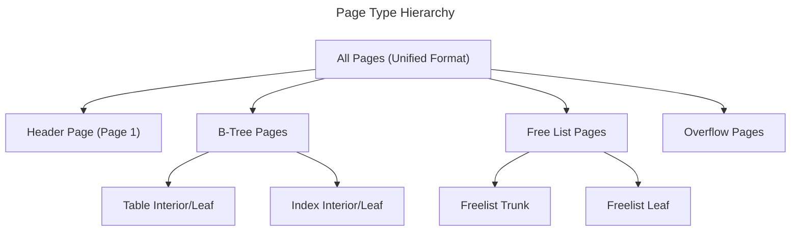
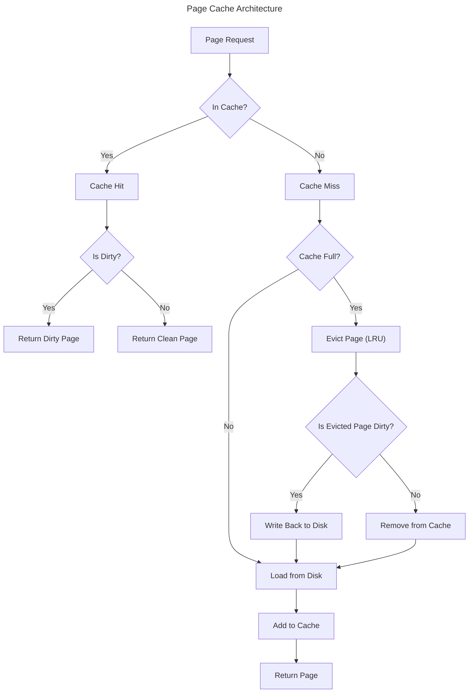

# Storage and Pages

## Introduction

This document describes the storage architecture of EpilogLite, including the page format, database file structure, and storage management. EpilogLite maintains compatibility with the SQLite file format where possible while introducing improvements for safety and performance.

## Page Architecture

### Unified Page Format

All pages in EpilogLite use an identical, simplified format:

```rust
struct Page {
	page_id: u32,        // Unique page identifier
	container_id: u32,   // Container (table/index) identifier
	crc: u32,            // Cyclic redundancy check
	slot_index: u16,     // Slot index for organization
	payload: Vec<u8>,    // Variable-length page content
}
```

**Design Rationale:**

- **Simplicity**: Single page format simplifies implementation
- **Type Safety**: Rust types ensure correctness
- **Integrity**: CRC check on every page
- **Flexibility**: Variable-length payload accommodates different needs

### Page Size

The page size is determined at database creation and remains fixed for the lifetime of the database.

**Supported Page Sizes:**

- Minimum: 512 bytes (2^9)
- Maximum: 65536 bytes (2^16)
- Must be a power of two
- Default: 4096 bytes

**Auto-Detection:**

- Page size detected from database header on open
- New databases use system-appropriate default
- Optimal page size depends on OS and workload

**Considerations:**

- Larger pages: Fewer I/O operations, more wasted space
- Smaller pages: More I/O operations, less wasted space
- Match filesystem block size for efficiency

### Page Types

EpilogLite uses different page types for different purposes:



#### Header Page (Page 1)

The first page of the database contains the file header.

**Structure:**

```text
Offset | Size  | Description
-------|-------|----------------------------------
0      | 16    | Magic string ("SQLite format 3\0" or "EPLite format 1\0")
16     | 2     | Page size
18     | 1     | File format write version
19     | 1     | File format read version
20     | 1     | Reserved bytes per page
21     | 1     | Always 64 (ignored)
22     | 1     | Always 32 (ignored)
23     | 1     | Always 32 (ignored)
24     | 4     | File change counter
28     | 4     | Database size in pages
32     | 4     | First freelist page
36     | 4     | Total freelist pages
40     | 4     | Schema cookie
44     | 4     | Schema format number
48     | 4     | Suggested page cache size
52     | 4     | Vacuum root page (0 = disabled)
56     | 4     | Text encoding
60     | 4     | User version
64     | 4     | Incremental vacuum mode
68     | 4     | Application ID
72     | 20    | Reserved (must be zero)
92     | 4     | Version-valid-for number
96     | 4     | SQLite/EpilogLite version number
```

**After Header:**

The remainder of page 1 contains the root page of the schema table (sqlite_schema).

#### B-Tree Pages

B-tree pages store table data and indexes.

**Page Structure:**

```text
+------------------+
| Page Header      | (page_id, container_id, crc, slot_index)
+------------------+
| Cell Pointer     | Array of offsets to cells
| Array            |
+------------------+
| Unallocated      | Free space
| Space            |
+------------------+
| Cell Content     | Actual cell data
| Area             | (grows backwards from end)
+------------------+
```

**Cell Types:**

1. **Table Interior Cell**: Pointer to child page + row ID
2. **Table Leaf Cell**: Row ID + row data
3. **Index Interior Cell**: Pointer to child page + index key
4. **Index Leaf Cell**: Index key + row ID reference

#### Freelist Pages

Freelist pages track unused pages in the database.

**Freelist Structure:**

- **Trunk Pages**: Contain list of leaf page numbers
- **Leaf Pages**: Available for reuse

**Benefits:**

- Reuse pages instead of growing file
- Fast page allocation
- Efficient space management

#### Overflow Pages

When cell data exceeds page size, overflow pages store the excess data.

**Overflow Chain:**

```text
Primary Page --> Overflow Page 1 --> Overflow Page 2 --> ...
```

## Database File Structure

### File Layout

```text
+------------------+
| Page 1: Header + | Contains file header and schema root
| Schema Root      |
+------------------+
| Page 2           |
+------------------+
| Page 3           |
+------------------+
| ...              | Data pages, B-tree pages, overflow pages
+------------------+
| Page N           |
+------------------+
```

### File Format Compatibility

EpilogLite maintains compatibility with SQLite format where possible:

**Compatible:**

- Overall file structure
- Page organization
- B-tree format
- SQL syntax (mostly)

**Extensions:**

- EPLite-specific header magic string
- Additional metadata in reserved space
- Enhanced integrity checking

**Mode Selection:**

Users can choose at database creation:

1. **SQLite Mode**: Full compatibility with SQLite 3
2. **EPLite Mode**: EpilogLite enhancements enabled

## Page Cache

### Cache Architecture

The page cache is a critical component for performance.



### Cache Implementation

**Data Structure:**

```rust
struct PageCache {
	pages: HashMap<u32, CachedPage>,
	dirty_pages: HashSet<u32>,
	max_size: usize,
	current_size: usize,
	lru: LruList,
}

struct CachedPage {
	page: Page,
	dirty: bool,
	pin_count: u32,
	last_accessed: Instant,
}
```

**Cache Operations:**

1. **Get**: Retrieve page from cache or disk
2. **Put**: Add page to cache
3. **Mark Dirty**: Track modified pages
4. **Flush**: Write dirty pages to disk
5. **Evict**: Remove pages to free memory

### Self-Tuning Cache

The page cache automatically adjusts its size based on workload:

**Tuning Factors:**

- Available system memory
- Hit rate statistics
- Dirty page ratio
- Access patterns

**Tuning Algorithm:**

```rust
fn auto_tune_cache_size(&mut self) {
	let hit_rate = self.cache_hits / (self.cache_hits + self.cache_misses);
	
	if hit_rate < 0.80 && self.current_size < self.max_memory {
		// Low hit rate: increase cache size
		self.max_size = (self.max_size * 1.2) as usize;
	} else if hit_rate > 0.95 && self.dirty_ratio < 0.1 {
		// High hit rate, few dirty pages: can decrease
		self.max_size = (self.max_size * 0.9) as usize;
	}
}
```

**Benefits:**

- Optimal memory usage
- Adapts to workload
- No manual tuning required

### Page Pinning

Pages can be "pinned" in memory to prevent eviction:

**Use Cases:**

- Currently executing operations
- Hot pages (frequently accessed)
- Critical structures (schema, indexes)

**Pin Management:**

```rust
impl PageCache {
	fn pin(&mut self, page_id: u32) {
		if let Some(page) = self.pages.get_mut(&page_id) {
			page.pin_count += 1;
		}
	}
	
	fn unpin(&mut self, page_id: u32) {
		if let Some(page) = self.pages.get_mut(&page_id) {
			page.pin_count = page.pin_count.saturating_sub(1);
		}
	}
	
	fn can_evict(&self, page_id: u32) -> bool {
		self.pages.get(&page_id)
			.map(|p| p.pin_count == 0)
			.unwrap_or(false)
	}
}
```

## Storage Management

### Space Allocation

EpilogLite uses a freelist for efficient space management.

**Allocation Strategy:**

1. Check freelist for available page
2. If freelist empty, extend file
3. Mark page as allocated
4. Initialize page structure

**Freelist Management:**

```rust
struct FreeList {
	trunk_page: u32,
	leaf_pages: Vec<u32>,
	total_free: u32,
}

impl FreeList {
	async fn allocate_page(&mut self) -> Result<u32> {
		if let Some(page_id) = self.leaf_pages.pop() {
			self.total_free -= 1;
			Ok(page_id)
		} else {
			// Extend file
			self.extend_file().await
		}
	}
	
	async fn free_page(&mut self, page_id: u32) -> Result<()> {
		self.leaf_pages.push(page_id);
		self.total_free += 1;
		
		if self.leaf_pages.len() > MAX_LEAF_PAGES {
			self.flush_to_trunk().await?;
		}
		
		Ok(())
	}
}
```

### Vacuum and Compaction

Over time, databases can become fragmented. Vacuuming reclaims space.

**Vacuum Process:**

1. Copy all data to temporary database
2. Drop original database
3. Rename temporary to original

**Auto-Vacuum:**

Automatic incremental vacuum can be enabled:

- Reclaim space automatically
- Triggered by free page threshold
- Configurable aggressiveness

### File Growth

Database files grow automatically as needed.

**Growth Strategy:**

- Extend by multiple pages at once
- Reduce system calls
- Pre-allocate for future growth

```rust
async fn extend_file(&mut self, pages_needed: u32) -> Result<()> {
	// Extend by at least 10% or pages_needed, whichever is larger
	let growth = pages_needed.max(self.total_pages / 10);
	
	let new_size = (self.total_pages + growth) * self.page_size as u32;
	self.file.truncate(new_size).await?;
	
	self.total_pages += growth;
	
	// Add new pages to freelist
	for page_id in (self.total_pages - growth)..self.total_pages {
		self.freelist.free_page(page_id).await?;
	}
	
	Ok(())
}
```

## Data Integrity

### Checksums

Every page includes a CRC32 checksum for integrity verification.

**Checksum Calculation:**

```rust
fn calculate_crc(page: &Page) -> u32 {
	let mut hasher = crc32fast::Hasher::new();
	hasher.update(&page.page_id.to_le_bytes());
	hasher.update(&page.container_id.to_le_bytes());
	hasher.update(&page.slot_index.to_le_bytes());
	hasher.update(&page.payload);
	hasher.finalize()
}

fn verify_page(page: &Page) -> bool {
	calculate_crc(page) == page.crc
}
```

**Verification Points:**

- On page read from disk
- After journal recovery
- Before writing to disk
- On cache eviction

### Corruption Detection

EpilogLite detects various corruption scenarios:

1. **Invalid CRC**: Page data corrupted
2. **Invalid Page Type**: Structural corruption
3. **Invalid Links**: B-tree corruption
4. **Size Mismatches**: File size issues

**Recovery Actions:**

- Attempt recovery from journal if available
- Report corruption to application
- Prevent further data loss

## Development Phase Status

### Phase I: Engine MVP

- [x] Page structure definition
- [x] Page cache implementation
- [x] Basic storage operations
- [x] Header parsing and validation
- [ ] Complete freelist implementation
- [ ] Overflow page support

### Phase II: Robustness & Performance

- [ ] Auto-vacuum implementation
- [ ] Cache self-tuning
- [ ] Comprehensive integrity checking
- [ ] Performance optimization
- [ ] Large file support (>4GB)

### Phase III: Cross-platform Testing

- [ ] Storage tests on all platforms
- [ ] File format compatibility testing
- [ ] Large database testing
- [ ] Corruption scenario testing

### Phase IV: Query API & Documentation

- [ ] Storage API documentation
- [ ] File format documentation
- [ ] Performance tuning guide
- [ ] Migration tools

## Performance Optimization

### Read Optimization

- **Page Cache**: Minimize disk reads
- **Read-Ahead**: Predict future reads
- **Batch Reads**: Read multiple pages at once

### Write Optimization

- **Write Coalescing**: Combine multiple writes
- **Delayed Writes**: Buffer writes in cache
- **Batch Commits**: Group transactions

### Memory Optimization

- **Efficient Data Structures**: Minimize overhead
- **Page Sharing**: Share read-only pages
- **Lazy Loading**: Load data on demand

## Future Enhancements

Planned storage enhancements:

- **Memory-Mapped I/O**: Optional mmap support
- **Compression**: Transparent page compression
- **Encryption**: Transparent encryption at page level
- **Tiered Storage**: Hot/cold data separation
- **Snapshots**: Point-in-time database snapshots

---

**Previous**: [Transaction Model](03_Transaction_Model.md) | **Next**: [Journaling and Recovery](05_Journaling_and_Recovery.md)
