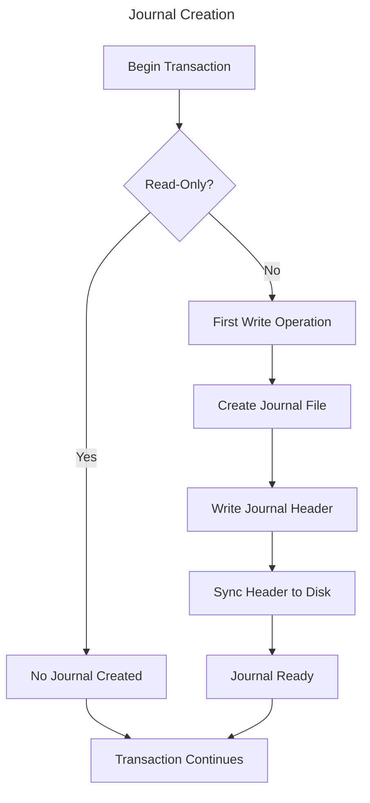
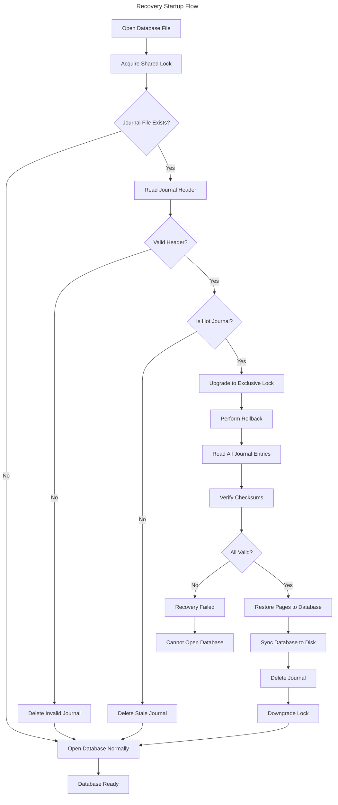

# Journaling and Recovery

## Introduction

This document describes EpilogLite's journaling mechanism and crash recovery procedures. The journal-first copy-on-write (COW) system ensures that all committed transactions survive crashes and power failures, providing durability guarantees essential for a production database.

## Journal-First COW Overview

EpilogLite uses a journal-first COW approach for transaction durability:

1. **Journal**: Write original page content before modification
2. **COW**: Modify pages in memory (copy-on-write)
3. **Commit**: Write modified pages to database
4. **Mark**: Mark journal as complete

This approach is simpler than SQLite's WAL mode and suitable for single-connection access in v1.

## Journal File Structure

### File Layout

```text
+------------------------+
| Journal Header         |  40 bytes
+------------------------+
| Page Entry 1           |
|   - Page Number (4)    |
|   - Page Size (4)      |
|   - Page Checksum (4)  |
|   - Page Data (N)      |
+------------------------+
| Page Entry 2           |
|   ...                  |
+------------------------+
| ...                    |
+------------------------+
| Page Entry M           |
+------------------------+
```

### Journal Header

```rust
struct JournalHeader {
	magic: [u8; 8],           // "EPLJRNL\0"
	version: u32,             // Journal format version
	page_count: u32,          // Number of pages in journal
	page_size: u32,           // Database page size
	db_size: u32,             // Original database size
	checksum: u32,            // Header checksum
	timestamp: i64,           // Creation timestamp
	reserved: [u8; 8],        // Reserved for future use
}
```

**Header Fields:**

- **magic**: Identifies valid journal file
- **version**: Journal format version (currently 1)
- **page_count**: Initially 0, updated before commit
- **page_size**: Must match database page size
- **db_size**: Original database size for recovery
- **checksum**: CRC32 of header fields
- **timestamp**: When transaction started
- **reserved**: Reserved for future extensions

### Page Entry

```rust
struct JournalPageEntry {
	page_number: u32,         // Database page number
	page_size: u32,           // Size of page data
	checksum: u32,            // CRC32 of page data
	data: Vec<u8>,            // Original page content
}
```

**Entry Validation:**

- Checksum must match page data
- Page number must be within database bounds
- Page size must match database page size

## Journal Lifecycle

### Creation

Journal file is created when the first write operation occurs in a transaction.



**File Naming:**

- Main database: `database.db`
- Journal file: `database.db-journal`

**Creation Steps:**

1. Generate journal filename from database filename
2. Create journal file with exclusive access
3. Write initial header (page_count = 0)
4. Sync header to disk
5. Keep file open for transaction duration

### Page Journaling

Before modifying any page, the original content is written to the journal.

```rust
async fn journal_page(&mut self, page_id: u32) -> Result<()> {
	// Read original page if not in cache
	let original_page = self.cache.get_or_load(page_id).await?;
	
	// Write to journal
	let entry = JournalPageEntry {
		page_number: page_id,
		page_size: original_page.len() as u32,
		checksum: calculate_crc(&original_page),
		data: original_page.clone(),
	};
	
	self.journal.write_entry(&entry).await?;
	
	// Update page count (but don't sync yet)
	self.journal.page_count += 1;
	
	Ok(())
}
```

**Journaling Rules:**

1. Journal entire page, not just modified bytes
2. Journal before any modification
3. Journal only once per transaction per page
4. Maintain journal order (for determinism)

### Journal Sync

Before writing to the database, the journal must be fully synced to disk.

```rust
async fn sync_journal(&mut self) -> Result<()> {
	// Update page count in header
	self.journal.update_header_page_count().await?;
	
	// Sync all data to disk
	self.journal.file.sync_all().await?;
	
	// Verify write completed
	self.journal.verify_integrity().await?;
	
	Ok(())
}
```

**Critical Guarantee:**

This step ensures that if a crash occurs during database writes, we can fully recover the original state.

### Journal Completion

After successfully committing the transaction, the journal is marked complete.

```rust
async fn complete_journal(&mut self) -> Result<()> {
	// Option 1: Delete journal file (safest, slowest)
	self.journal.delete().await?;
	
	// Option 2: Truncate to zero length (faster)
	// self.journal.truncate(0).await?;
	
	// Option 3: Zero header (fastest, keeps file)
	// self.journal.zero_header().await?;
	
	Ok(())
}
```

**Completion Methods:**

1. **Delete**: Remove journal file completely
2. **Truncate**: Truncate to zero length
3. **Zero Header**: Overwrite header with zeros

**Method Selection:**

- Delete: Maximum safety, filesystem updates directory
- Truncate: Good safety, faster, no directory update
- Zero Header: Fast, reuses file, atomic in most cases

## Crash Recovery

### Recovery Startup Flow

On database open, EpilogLite checks for a hot journal and performs recovery if needed.



### Hot Journal Detection

A journal is considered "hot" if it requires recovery.

**Hot Journal Criteria:**

```rust
fn is_hot_journal(&self, journal_path: &Path, db_file: &File) -> Result<bool> {
	// Journal must exist
	if !journal_path.exists() {
		return Ok(false);
	}
	
	// Journal must not be empty
	let journal_size = journal_path.metadata()?.len();
	if journal_size == 0 {
		return Ok(false);
	}
	
	// Must not have reserved lock (indicates active transaction)
	if db_file.has_reserved_lock()? {
		return Ok(false);
	}
	
	// Header must be valid
	let header = self.read_journal_header(journal_path)?;
	if !header.is_valid() {
		return Ok(false);
	}
	
	// If page count is 0, journal is incomplete
	if header.page_count == 0 {
		return Ok(false);
	}
	
	// All criteria met: this is a hot journal
	Ok(true)
}
```

### Recovery Process

The recovery process restores the database to its pre-transaction state.

```rust
async fn perform_recovery(&mut self, journal_path: &Path) -> Result<()> {
	// 1. Read journal header
	let header = self.read_journal_header(journal_path).await?;
	
	// 2. Validate header
	if !header.is_valid() {
		return Err(Error::CorruptJournal);
	}
	
	// 3. Read all page entries
	let mut entries = Vec::new();
	for i in 0..header.page_count {
		let entry = self.read_journal_entry(i).await?;
		
		// Verify checksum
		if !entry.verify_checksum() {
			return Err(Error::CorruptJournalPage(i));
		}
		
		entries.push(entry);
	}
	
	// 4. Restore pages to database
	for entry in entries {
		self.write_page_to_db(entry.page_number, &entry.data).await?;
	}
	
	// 5. Truncate database if it was extended
	if self.current_db_size > header.db_size {
		self.truncate_database(header.db_size).await?;
	}
	
	// 6. Sync database to disk
	self.db_file.sync_all().await?;
	
	// 7. Delete journal
	self.delete_journal(journal_path).await?;
	
	// 8. Verify database integrity
	self.verify_database_integrity().await?;
	
	Ok(())
}
```

### Recovery Scenarios

#### Scenario 1: Incomplete Journal

**Situation:**

- Crash occurred while writing journal
- Page count in header is 0
- Some page entries may be present but incomplete

**Recovery:**

```rust
// Journal with page_count = 0 is incomplete
if header.page_count == 0 {
	// No recovery needed, transaction never committed
	self.delete_journal(journal_path).await?;
	return Ok(());
}
```

**Result:** No rollback needed, database unchanged.

#### Scenario 2: Complete Journal, Database Unchanged

**Situation:**

- Journal fully written and synced
- Crash before database writes started
- Database still in original state

**Recovery:**

```rust
// Rollback not strictly needed, but performed for consistency
for entry in journal_entries {
	// Write original pages back (no-op if unchanged)
	self.write_page_to_db(entry.page_number, &entry.data).await?;
}
```

**Result:** Database restored to original state (was already there).

#### Scenario 3: Partial Database Update

**Situation:**

- Journal complete
- Some pages written to database
- Crash before all pages written

**Recovery:**

```rust
// Restore all pages from journal
for entry in journal_entries {
	// Overwrite any partially updated pages
	self.write_page_to_db(entry.page_number, &entry.data).await?;
}
```

**Result:** Database restored to pre-transaction state.

#### Scenario 4: Complete Database Update, Journal Not Marked

**Situation:**

- Journal complete
- All pages written to database
- Crash before journal deleted/truncated

**Recovery:**

```rust
// Rollback even though database was updated
// This is conservative but ensures consistency
for entry in journal_entries {
	self.write_page_to_db(entry.page_number, &entry.data).await?;
}
```

**Result:** Transaction rolled back, even though it completed writing.

**Note:** This is conservative. In the future, we may detect this case and allow the commit to stand.

### Stale Journal Detection

A journal may exist but not be hot (stale journal).

**Stale Journal Criteria:**

- Journal file exists
- Database has reserved lock (active transaction)
- Or: Journal header invalid
- Or: Journal page count is 0

**Handling:**

```rust
if !self.is_hot_journal(journal_path, &db_file)? {
	// Safe to delete stale journal
	fs::remove_file(journal_path).await?;
}
```

## Error Handling

### Journal Write Failures

If journal writes fail, the transaction cannot proceed safely.

```rust
async fn handle_journal_write_error(&mut self, error: Error) -> Result<()> {
	// Journal write failed - cannot proceed
	log::error!("Journal write failed: {}", error);
	
	// Roll back in-memory changes
	self.cache.clear_dirty_pages();
	
	// Delete incomplete journal
	if let Some(journal_path) = &self.journal_path {
		let _ = fs::remove_file(journal_path).await;
	}
	
	// Release locks
	self.release_locks().await?;
	
	Err(Error::JournalWriteFailed(error))
}
```

### Recovery Failures

If recovery fails, the database cannot be safely opened.

```rust
async fn handle_recovery_failure(&mut self, error: Error) -> Result<()> {
	log::error!("Recovery failed: {}", error);
	
	// Do not delete journal - may need manual recovery
	// Do not modify database - may corrupt further
	
	// Return error to application
	Err(Error::RecoveryFailed(error))
}
```

**Recovery Failure Actions:**

1. Log detailed error information
2. Preserve journal file for analysis
3. Do not modify database
4. Return error to application
5. Application must handle (report to user, restore from backup)

### Corrupt Journal

If the journal is corrupt, recovery may not be possible.

```rust
async fn handle_corrupt_journal(&mut self, journal_path: &Path) -> Result<()> {
	log::error!("Corrupt journal detected: {:?}", journal_path);
	
	// Try to read as much as possible
	let partial_entries = self.read_partial_journal(journal_path).await?;
	
	if partial_entries.is_empty() {
		// No valid entries, delete journal
		fs::remove_file(journal_path).await?;
		return Ok(());
	}
	
	// Some valid entries found, attempt partial recovery
	log::warn!("Attempting partial recovery with {} pages", partial_entries.len());
	
	for entry in partial_entries {
		self.write_page_to_db(entry.page_number, &entry.data).await?;
	}
	
	self.db_file.sync_all().await?;
	fs::remove_file(journal_path).await?;
	
	Ok(())
}
```

## Testing and Validation

### Recovery Testing

Recovery must be thoroughly tested to ensure reliability.

**Test Scenarios:**

1. Crash at each step of commit cycle
2. Corrupt journal headers
3. Corrupt page entries
4. Partial journal writes
5. Multiple recovery attempts
6. Large transactions (many pages)
7. Small transactions (few pages)

**Testing Tools:**

```rust
// Simulate crash at specific point
struct CrashSimulator {
	crash_points: Vec<CrashPoint>,
	current_point: usize,
}

enum CrashPoint {
	BeforeJournalCreate,
	AfterJournalHeader,
	AfterPageEntry(u32),
	AfterJournalSync,
	AfterDatabaseWrite(u32),
	AfterDatabaseSync,
	BeforeJournalDelete,
}

impl CrashSimulator {
	async fn maybe_crash(&mut self, point: CrashPoint) {
		if self.should_crash(&point) {
			// Simulate crash
			panic!("Simulated crash at {:?}", point);
		}
		self.current_point += 1;
	}
}
```

### Integrity Verification

After recovery, verify database integrity.

```rust
async fn verify_database_integrity(&self) -> Result<()> {
	// 1. Verify header
	self.verify_header()?;
	
	// 2. Verify all pages have valid checksums
	for page_id in 1..=self.page_count {
		let page = self.read_page(page_id).await?;
		if !page.verify_checksum() {
			return Err(Error::CorruptPage(page_id));
		}
	}
	
	// 3. Verify B-tree structure
	self.verify_btree_structure().await?;
	
	// 4. Verify freelist consistency
	self.verify_freelist().await?;
	
	Ok(())
}
```

## Development Phase Status

### Phase I: Engine MVP

- [x] Basic journal structure
- [ ] Complete journal-first COW implementation
- [ ] Recovery implementation
- [ ] Hot journal detection
- [ ] Stale journal handling

### Phase II: Robustness & Performance

- [ ] Comprehensive recovery testing
- [ ] Crash simulation framework
- [ ] Partial recovery support
- [ ] Performance optimization
- [ ] Large transaction handling

### Phase III: Cross-platform Testing

- [ ] Recovery testing on all platforms
- [ ] Platform-specific crash scenarios
- [ ] Filesystem-specific testing
- [ ] Long-running recovery tests

### Phase IV: Query API & Documentation

- [ ] Recovery documentation
- [ ] Troubleshooting guide
- [ ] Recovery tools
- [ ] Best practices

## Performance Considerations

### Journal Write Performance

Journal writes are synchronous and can be slow.

**Optimizations:**

- Batch multiple page entries
- Use larger write buffers
- Consider journal file pre-allocation
- Tune fsync frequency (with care)

### Recovery Performance

Recovery should be fast to minimize downtime.

**Optimizations:**

- Parallel page restoration (future)
- Incremental checksum verification
- Early validation to fail fast
- Minimize redundant operations

## Future Enhancements

Planned journaling enhancements:

- **Parallel Recovery**: Restore multiple pages concurrently
- **Journal Checksumming**: Incremental checksums for faster validation
- **Journal Compression**: Compress journal entries
- **Journal Encryption**: Encrypt sensitive journal data
- **Write-Ahead Logging**: Alternative to journal-first COW

---

**Previous**: [Storage and Pages](04_Storage_and_Pages.md) | **Next**: [Performance Optimization](06_Performance_Optimization.md)
