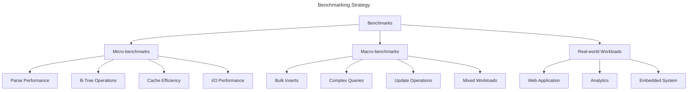

# Performance Optimization

## Introduction

This document describes performance characteristics and optimization strategies for EpilogLite. While correctness and safety are paramount, performance is also critical for a production database engine.

## Performance Philosophy

### Priorities

1. **Correctness First**: Never sacrifice correctness for performance
2. **Safety Always**: All optimizations must be memory-safe
3. **Measure Before Optimizing**: Profile before making changes
4. **Optimize Common Cases**: Focus on typical workloads
5. **Document Trade-offs**: Explain performance characteristics

### Approach

- Benchmark against SQLite as baseline
- Profile to identify bottlenecks
- Optimize hot paths first
- Use Rust's zero-cost abstractions
- Leverage async I/O for concurrency

## Benchmarking Strategy

### Benchmark Types



### Benchmark Framework

```rust
use criterion::{black_box, criterion_group, criterion_main, Criterion};

fn bench_insert(c: &mut Criterion) {
	let runtime = tokio::runtime::Runtime::new().unwrap();
	
	c.bench_function("insert_1000_rows", |b| {
		b.to_async(&runtime).iter(|| async {
			let db = setup_database().await;
			for i in 0..1000 {
				db.execute("INSERT INTO users VALUES (?, ?)", 
					&[&i, &format!("User{}", i)]).await.unwrap();
			}
		});
	});
}

criterion_group!(benches, bench_insert);
criterion_main!(benches);
```

### Performance Metrics

**Key Metrics:**

- **Throughput**: Operations per second
- **Latency**: Time per operation (p50, p95, p99)
- **Memory Usage**: RAM consumption
- **Disk I/O**: Read/write operations
- **CPU Usage**: Processor utilization
- **Cache Hit Rate**: Page cache effectiveness

## I/O Performance

### Async I/O Advantages

EpilogLite uses async I/O for better performance:

**Benefits:**

- Non-blocking operations
- Efficient task scheduling
- Better resource utilization
- Scales with concurrent operations

**Async vs Sync Performance:**

```rust
// Benchmark comparison
async fn compare_io_performance() {
	let sync_time = measure_sync_operations(1000);
	let async_time = measure_async_operations(1000);
	
	println!("Sync:  {} ops/sec", 1000.0 / sync_time);
	println!("Async: {} ops/sec", 1000.0 / async_time);
	println!("Speedup: {}x", sync_time / async_time);
}
```

**When Async Wins:**

- Many concurrent connections
- I/O-bound workloads
- Network-based storage
- High-latency operations

**When Sync Competes:**

- Single-threaded access
- Fast local storage
- CPU-bound operations
- Small transactions

### File System Optimization

**Techniques:**

1. **Buffered I/O**: Batch small operations
2. **Direct I/O**: Bypass OS cache for large operations
3. **Pre-allocation**: Allocate space in advance
4. **Aligned Writes**: Match filesystem block size

```rust
async fn optimize_file_operations(&mut self) -> Result<()> {
	// Enable write buffering
	self.file.set_write_buffer_size(64 * 1024)?;
	
	// Pre-allocate file space
	self.file.preallocate(self.expected_size).await?;
	
	// Use aligned writes
	self.ensure_alignment(self.page_size)?;
	
	Ok(())
}
```

### fsync Strategy

Synchronous disk writes (fsync) are expensive but necessary for durability.

**fsync Points:**

1. After journal sync (critical)
2. After database write (critical)
3. After checkpoint (if implemented)

**Optimization:**

- Batch multiple operations before fsync
- Use group commit for multiple transactions
- Consider durability vs. performance trade-offs

```rust
// Group commit: batch multiple transactions
async fn group_commit(&mut self, transactions: Vec<Transaction>) -> Result<()> {
	// Write all journals
	for txn in &transactions {
		self.write_journal(txn).await?;
	}
	
	// Single fsync for all journals
	self.journal_file.sync_all().await?;
	
	// Write all database changes
	for txn in &transactions {
		self.write_changes(txn).await?;
	}
	
	// Single fsync for all changes
	self.db_file.sync_all().await?;
	
	// Mark all journals complete
	for txn in &transactions {
		self.complete_journal(txn).await?;
	}
	
	Ok(())
}
```

## Memory Performance

### Page Cache Optimization

The page cache is critical for read performance.

**Cache Size:**

```rust
fn calculate_optimal_cache_size() -> usize {
	let system_memory = get_system_memory();
	let available_memory = system_memory * 0.25; // Use 25% of system RAM
	let page_size = 4096;
	
	available_memory / page_size
}
```

**Cache Efficiency:**

- LRU eviction for hot pages
- Pin frequently accessed pages
- Pre-fetch sequential pages
- Cache schema and index pages

**Metrics:**

```rust
struct CacheMetrics {
	hits: u64,
	misses: u64,
	evictions: u64,
	dirty_pages: usize,
	memory_used: usize,
}

impl CacheMetrics {
	fn hit_rate(&self) -> f64 {
		self.hits as f64 / (self.hits + self.misses) as f64
	}
	
	fn should_grow(&self) -> bool {
		self.hit_rate() < 0.80 && self.memory_used < self.max_memory
	}
	
	fn should_shrink(&self) -> bool {
		self.hit_rate() > 0.95 && self.dirty_pages < self.total_pages / 10
	}
}
```

### Memory Allocation

**Strategies:**

1. **Pre-allocate**: Allocate memory upfront
2. **Pool**: Reuse allocations
3. **Arena**: Bulk allocation for temporary data
4. **Zero-copy**: Avoid unnecessary copies

```rust
// Memory pool for pages
struct PagePool {
	available: Vec<Box<[u8]>>,
	page_size: usize,
	max_pool_size: usize,
}

impl PagePool {
	fn get(&mut self) -> Box<[u8]> {
		self.available.pop()
			.unwrap_or_else(|| vec![0; self.page_size].into_boxed_slice())
	}
	
	fn return_page(&mut self, page: Box<[u8]>) {
		if self.available.len() < self.max_pool_size {
			self.available.push(page);
		}
		// else: let it drop and be deallocated
	}
}
```

### Memory Fragmentation

**Mitigation:**

- Use fixed-size allocations where possible
- Pool allocations of common sizes
- Periodic compaction (if needed)
- Monitor fragmentation metrics

## Query Performance

### Query Optimization

The query optimizer chooses efficient execution plans.

**Optimization Techniques:**

1. **Index Selection**: Choose optimal indexes
2. **Join Ordering**: Minimize intermediate results
3. **Predicate Pushdown**: Filter early
4. **Constant Folding**: Evaluate constants at compile time
5. **Dead Code Elimination**: Remove unreachable code

```rust
// Example optimization: predicate pushdown
fn optimize_query(query: &mut QueryPlan) {
	// Push WHERE clauses down to table scans
	for node in query.nodes_mut() {
		if let Node::Filter(filter) = node {
			if let Some(scan) = node.child_mut() {
				if let Node::TableScan(scan) = scan {
					scan.add_filter(filter.predicate.clone());
				}
			}
		}
	}
}
```

### Index Usage

Indexes dramatically improve query performance.

**Index Types:**

- **Primary Key**: B-tree on row ID (implicit)
- **Secondary Index**: B-tree on indexed columns
- **Covering Index**: Index includes all needed columns

**Index Selection:**

```rust
fn select_index(&self, table: &Table, predicates: &[Predicate]) -> Option<Index> {
	let mut best_index = None;
	let mut best_score = 0;
	
	for index in &table.indexes {
		let score = self.score_index(index, predicates);
		if score > best_score {
			best_score = score;
			best_index = Some(index);
		}
	}
	
	best_index
}

fn score_index(&self, index: &Index, predicates: &[Predicate]) -> u32 {
	let mut score = 0;
	
	// Prefer indexes on equality predicates
	for pred in predicates {
		if pred.operator == Operator::Equals && 
		   index.columns.contains(&pred.column) {
			score += 10;
		}
	}
	
	// Prefer indexes on range predicates
	for pred in predicates {
		if pred.operator.is_range() && 
		   index.columns.contains(&pred.column) {
			score += 5;
		}
	}
	
	score
}
```

### Prepared Statements

Prepared statements cache parsed queries and execution plans.

**Benefits:**

- Parse query once, execute many times
- Reuse execution plan
- Efficient parameter binding
- Reduced CPU overhead

```rust
struct PreparedStatement {
	sql: String,
	bytecode: Vec<Instruction>,
	plan: QueryPlan,
	param_count: usize,
}

impl PreparedStatement {
	async fn execute(&self, params: &[Value]) -> Result<ResultSet> {
		// Validate parameter count
		if params.len() != self.param_count {
			return Err(Error::ParamCountMismatch);
		}
		
		// Execute pre-compiled bytecode
		let mut vm = VirtualMachine::new();
		vm.load_bytecode(&self.bytecode);
		vm.bind_parameters(params);
		vm.execute().await
	}
}
```

## Write Performance

### Batch Operations

Batch multiple operations to reduce overhead.

**Transaction Batching:**

```sql
-- Poor: Many small transactions
INSERT INTO users VALUES (1, 'Alice');
INSERT INTO users VALUES (2, 'Bob');
INSERT INTO users VALUES (3, 'Carol');

-- Better: One transaction
BEGIN;
INSERT INTO users VALUES (1, 'Alice');
INSERT INTO users VALUES (2, 'Bob');
INSERT INTO users VALUES (3, 'Carol');
COMMIT;
```

**Performance Impact:**

- 1 transaction: 1 fsync cycle
- N transactions: N fsync cycles
- Speedup: ~Nx for small operations

### Bulk Insert Optimization

Special optimizations for bulk inserts:

```rust
async fn bulk_insert(&mut self, rows: Vec<Row>) -> Result<()> {
	self.begin_transaction().await?;
	
	// Disable auto-commit
	self.auto_commit = false;
	
	// Sort rows by primary key for better locality
	rows.sort_by_key(|r| r.primary_key());
	
	// Pre-allocate pages
	let pages_needed = estimate_pages_needed(&rows);
	self.pager.preallocate(pages_needed).await?;
	
	// Insert rows
	for row in rows {
		self.insert_row(row).await?;
	}
	
	self.commit_transaction().await?;
	self.auto_commit = true;
	
	Ok(())
}
```

### Index Maintenance

Index updates can be expensive during writes.

**Optimization:**

- Defer index updates until commit
- Batch index updates
- Use bulk loading for indexes
- Consider dropping and rebuilding for large imports

```rust
async fn bulk_load_with_indexes(&mut self, rows: Vec<Row>) -> Result<()> {
	// Drop indexes temporarily
	let indexes = self.drop_indexes().await?;
	
	// Load data
	self.bulk_insert(rows).await?;
	
	// Rebuild indexes efficiently
	for index in indexes {
		self.rebuild_index(&index).await?;
	}
	
	Ok(())
}
```

## Development Phase Status

### Phase I: Engine MVP

- [x] Basic async I/O
- [x] Page cache
- [x] Simple query execution
- [ ] Query optimization
- [ ] Index usage

### Phase II: Robustness & Performance

- [ ] Query optimizer implementation
- [ ] Index selection algorithm
- [ ] Prepared statement caching
- [ ] Bulk operation optimization
- [ ] Memory management tuning
- [ ] Comprehensive benchmarks

### Phase III: Cross-platform Testing

- [ ] Performance testing on all platforms
- [ ] Benchmark suite
- [ ] Regression testing
- [ ] Comparison with SQLite

### Phase IV: Query API & Documentation

- [ ] Performance tuning guide
- [ ] Benchmarking tools
- [ ] Best practices documentation
- [ ] Optimization examples

## Profiling and Debugging

### Profiling Tools

**Recommended Tools:**

- **cargo-flamegraph**: CPU flame graphs
- **heaptrack**: Memory profiling
- **perf**: Linux performance analysis
- **Instruments**: macOS profiling

**Usage:**

```bash
# CPU profiling
cargo flamegraph --bin epiloglite

# Memory profiling
heaptrack epiloglite

# Performance analysis
perf record -g ./target/release/epiloglite
perf report
```

### Performance Monitoring

**Runtime Metrics:**

```rust
struct PerformanceMonitor {
	query_count: AtomicU64,
	query_time: AtomicU64,
	cache_hits: AtomicU64,
	cache_misses: AtomicU64,
	io_reads: AtomicU64,
	io_writes: AtomicU64,
}

impl PerformanceMonitor {
	fn report(&self) -> PerformanceReport {
		PerformanceReport {
			queries_per_sec: self.query_count.load(Ordering::Relaxed) / self.uptime,
			avg_query_time: self.query_time.load(Ordering::Relaxed) / self.query_count.load(Ordering::Relaxed),
			cache_hit_rate: self.cache_hits.load(Ordering::Relaxed) as f64 / 
				(self.cache_hits.load(Ordering::Relaxed) + self.cache_misses.load(Ordering::Relaxed)) as f64,
			io_operations: self.io_reads.load(Ordering::Relaxed) + self.io_writes.load(Ordering::Relaxed),
		}
	}
}
```

## Performance Best Practices

### For Application Developers

1. **Use Transactions**: Batch operations in transactions
2. **Prepare Statements**: Reuse prepared statements
3. **Create Indexes**: Index frequently queried columns
4. **Analyze Queries**: Use EXPLAIN to understand query plans
5. **Tune Cache**: Configure cache size appropriately

### For EpilogLite Developers

1. **Profile First**: Measure before optimizing
2. **Optimize Hot Paths**: Focus on frequent operations
3. **Benchmark Regularly**: Catch performance regressions
4. **Document Trade-offs**: Explain performance characteristics
5. **Test at Scale**: Test with realistic data sizes

## Future Optimizations

Planned performance enhancements:

- **Parallel Query Execution**: Multi-threaded query processing
- **SIMD Operations**: Vectorized operations for filters and aggregates
- **JIT Compilation**: Just-in-time compilation of hot queries
- **Adaptive Optimization**: Learn from query patterns
- **Connection Pooling**: Efficient multi-connection support
- **Query Result Caching**: Cache frequent query results

---

**Previous**: [Journaling and Recovery](05_Journaling_and_Recovery.md) | **Next**: [Future Extensions](07_Future_Extensions.md)
