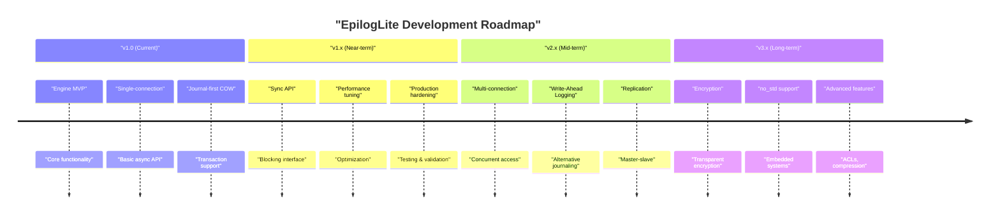
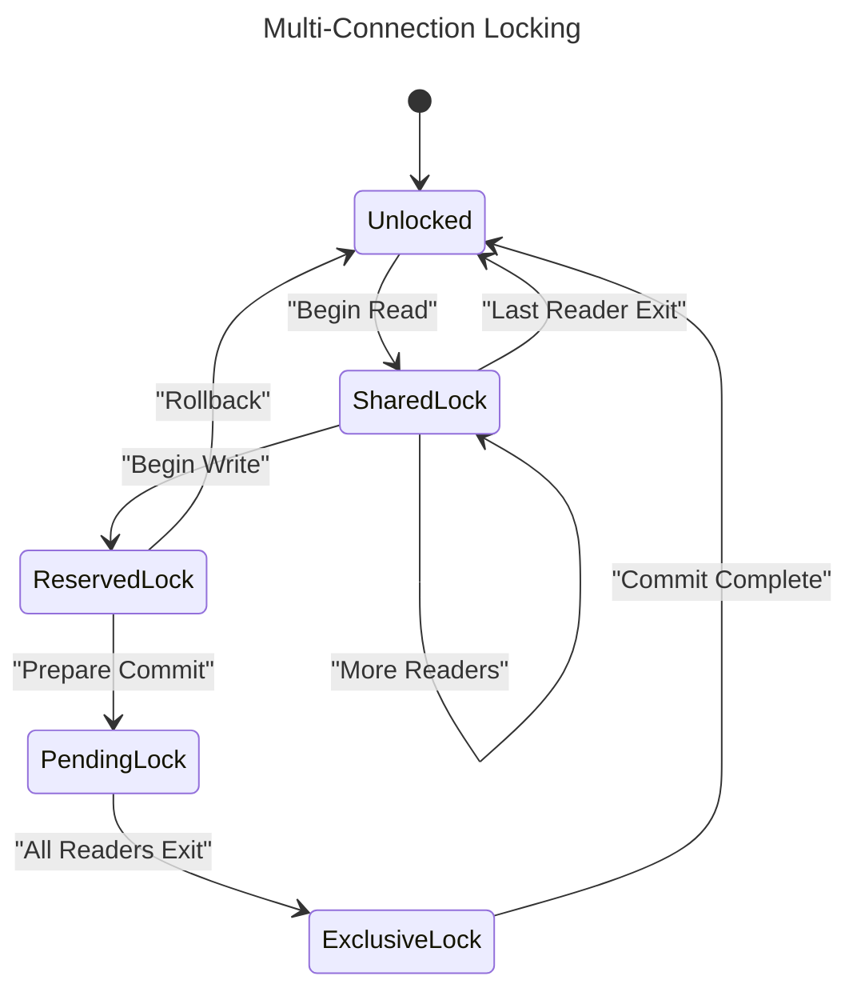
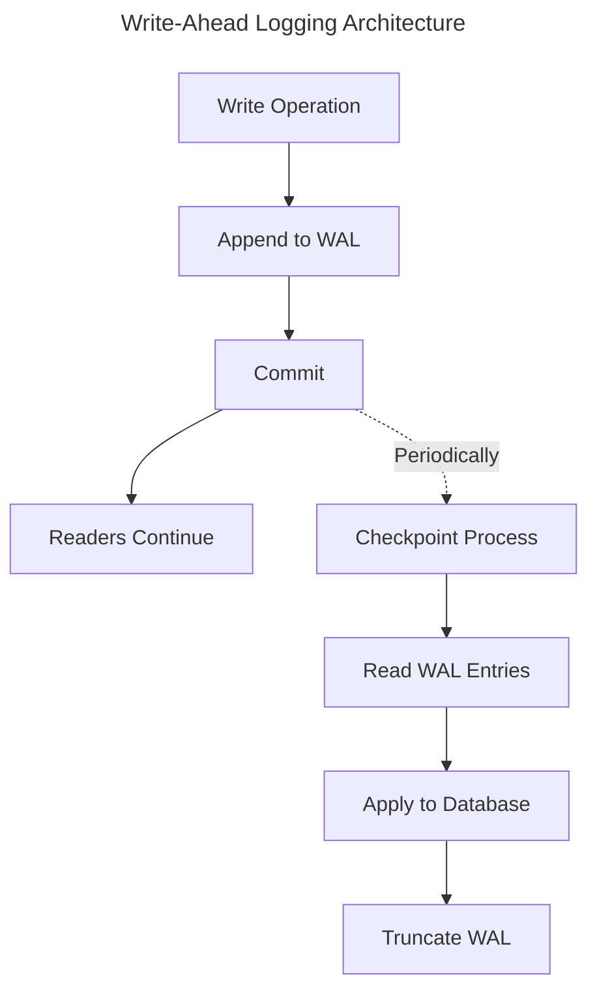
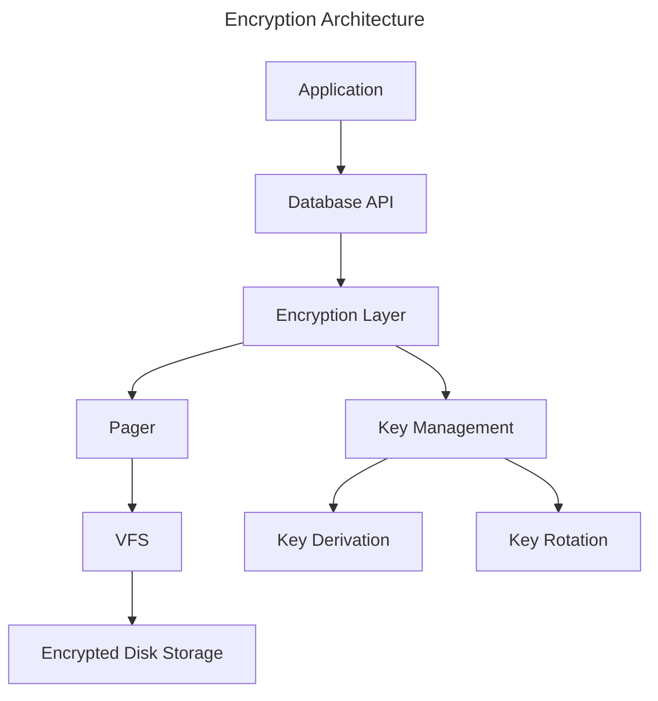
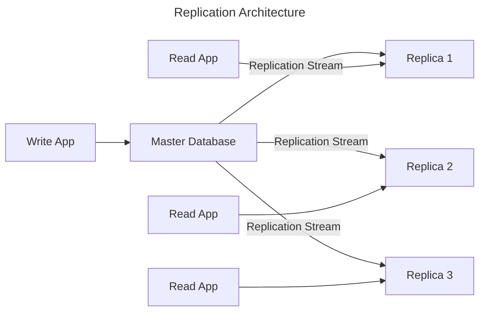

# Future Extensions

## Introduction

This document describes features and extensions planned for future versions of EpilogLite beyond v1.0. While these features are out of scope for the initial release, the architecture is designed to support them.

## Roadmap Overview



## Synchronous API (v1.x)

### Overview

While EpilogLite is async-first, a synchronous API will be provided for applications that don't use async/await.

### Rationale

**Use Cases:**

- CLI tools and batch processors
- Legacy code integration
- Simple scripts
- Learning and prototyping

### Design

**Approach:** Sync API wraps async implementation:

```rust
pub struct Database {
	async_db: AsyncDatabase,
	runtime: Runtime,
}

impl Database {
	pub fn open(path: &str) -> Result<Self> {
		let runtime = Runtime::new()?;
		let async_db = runtime.block_on(AsyncDatabase::open(path))?;
		Ok(Self { async_db, runtime })
	}
	
	pub fn execute(&self, sql: &str) -> Result<()> {
		self.runtime.block_on(self.async_db.execute(sql))
	}
	
	pub fn query(&self, sql: &str) -> Result<ResultSet> {
		self.runtime.block_on(self.async_db.query(sql))
	}
}
```

### Trade-offs

**Advantages:**

- Simple API for non-async code
- Reuses async implementation
- No code duplication

**Disadvantages:**

- Runtime overhead
- Blocks calling thread
- Cannot mix with async code efficiently

### Status

- [ ] Design sync API interface
- [ ] Implement blocking wrappers
- [ ] Test sync API
- [ ] Document sync vs async trade-offs

## Multi-Connection Support (v2.0)

### Overview

Support multiple concurrent connections to the same database.

### Rationale

**Use Cases:**

- Web applications with multiple threads
- Server applications
- Concurrent batch processing
- Read replicas

### Design

**Locking Model:**



**Key Changes:**

1. **Shared Locks**: Multiple readers can coexist
2. **Reserved Lock**: One writer prepares while readers continue
3. **Pending Lock**: Block new readers, wait for existing readers
4. **Exclusive Lock**: Write to database

### Challenges

1. **Lock Contention**: Writers may starve with many readers
2. **Deadlock Prevention**: Avoid deadlock scenarios
3. **Fairness**: Balance reader and writer access
4. **Performance**: Minimize lock overhead

### Solution: MVCC

**Multi-Version Concurrency Control:**

- Writers create new versions
- Readers see consistent snapshots
- No blocking between readers and writers
- Garbage collection of old versions

```rust
struct MvccVersion {
	transaction_id: u64,
	page_data: Vec<u8>,
	next_version: Option<Box<MvccVersion>>,
}

struct MvccPage {
	current_version: MvccVersion,
	history: Vec<MvccVersion>,
}
```

### Status

- [ ] Design multi-connection locking protocol
- [ ] Implement MVCC infrastructure
- [ ] Implement shared/exclusive locks
- [ ] Test concurrent access scenarios
- [ ] Benchmark multi-connection performance

## Write-Ahead Logging (v2.0)

### Overview

Implement Write-Ahead Logging (WAL) as an alternative to journal-first COW.

### Rationale

**Advantages of WAL:**

- Better write performance
- Reduced write amplification
- Concurrent readers during writes
- Faster commits

**Trade-offs:**

- More complex implementation
- Requires WAL file management
- Checkpoint process needed
- Larger disk footprint

### Design

**WAL Architecture:**



**WAL File Format:**

```text
+------------------+
| WAL Header       |
+------------------+
| Frame 1          |  (page_id, page_data, checksum)
+------------------+
| Frame 2          |
+------------------+
| ...              |
+------------------+
| Commit Record    |
+------------------+
```

### Status

- [ ] Design WAL file format
- [ ] Implement WAL writing
- [ ] Implement checkpoint process
- [ ] Implement WAL recovery
- [ ] Test WAL mode
- [ ] Benchmark WAL vs journal

## Encryption (v2.x)

### Overview

Transparent database encryption for data at rest.

### Rationale

**Use Cases:**

- Sensitive data protection
- Compliance requirements (HIPAA, GDPR)
- Mobile applications
- Cloud storage

### Design

**Encryption Layers:**



**Encryption Scope:**

- **Page-level encryption**: Encrypt each page independently
- **IV per page**: Unique initialization vector
- **Authenticated encryption**: AEAD (e.g., AES-GCM)
- **Key derivation**: PBKDF2 or Argon2

**Implementation:**

```rust
struct EncryptedPage {
	page_id: u32,
	iv: [u8; 12],           // Initialization vector
	encrypted_data: Vec<u8>, // Encrypted payload
	auth_tag: [u8; 16],      // Authentication tag
}

async fn encrypt_page(&self, page: &Page, key: &Key) -> Result<EncryptedPage> {
	let iv = generate_iv(page.page_id);
	let cipher = Aes256Gcm::new(key);
	let nonce = Nonce::from_slice(&iv);
	
	let encrypted_data = cipher.encrypt(nonce, page.payload.as_ref())?;
	
	Ok(EncryptedPage {
		page_id: page.page_id,
		iv,
		encrypted_data,
		auth_tag: /* extracted from encrypted_data */,
	})
}
```

### Challenges

1. **Key Management**: Secure key storage and distribution
2. **Performance**: Encryption overhead
3. **Key Rotation**: Changing keys without downtime
4. **Backup**: Encrypted backups

### Status

- [ ] Design encryption architecture
- [ ] Select encryption algorithms
- [ ] Implement page encryption
- [ ] Implement key management
- [ ] Implement key rotation
- [ ] Test encrypted databases
- [ ] Benchmark encryption overhead

## Access Control Lists (v2.x)

### Overview

Fine-grained access control for database objects.

### Rationale

**Use Cases:**

- Multi-tenant applications
- User-level permissions
- Role-based access control
- Column-level security

### Design

**Permission Model:**

```sql
-- Grant permissions
GRANT SELECT, INSERT ON users TO role_user;
GRANT ALL ON users TO role_admin;

-- Revoke permissions
REVOKE INSERT ON users FROM role_user;

-- Row-level security
CREATE POLICY user_isolation ON users
	FOR SELECT
	USING (user_id = current_user_id());
```

**ACL Storage:**

```rust
struct AccessControlList {
	principal: Principal,     // User or role
	resource: Resource,       // Table, column, row
	permissions: Permissions, // SELECT, INSERT, UPDATE, DELETE
}

enum Principal {
	User(UserId),
	Role(RoleId),
	Everyone,
}

enum Resource {
	Database,
	Schema(String),
	Table(String),
	Column(String, String), // table, column
	Row(String, RowId),     // table, row
}
```

### Status

- [ ] Design ACL model
- [ ] Implement permission storage
- [ ] Implement permission checking
- [ ] Implement role management
- [ ] Test ACL enforcement
- [ ] Document ACL usage

## no_std Support (v3.0)

### Overview

Support for embedded systems without the standard library.

### Rationale

**Use Cases:**

- Embedded systems
- Bare-metal applications
- WebAssembly
- Minimal deployments

### Design

**Conditional Compilation:**

```rust
#[cfg(feature = "std")]
use std::collections::HashMap;

#[cfg(not(feature = "std"))]
use alloc::collections::BTreeMap as HashMap;

#[cfg(feature = "std")]
async fn async_operation() { /* tokio */ }

#[cfg(not(feature = "std"))]
fn blocking_operation() { /* no async */ }
```

**Abstractions:**

- Abstract allocator
- Abstract time source
- Abstract random source
- Abstract file I/O (or in-memory)

### Challenges

1. **No Async**: Tokio requires std
2. **No File I/O**: May need in-memory only
3. **Limited Allocator**: Custom allocator support
4. **Testing**: Harder to test

### Status

- [ ] Audit dependencies for no_std compatibility
- [ ] Abstract std-dependent features
- [ ] Implement no_std alternatives
- [ ] Test on embedded targets
- [ ] Document no_std usage

## Memory-Mapped I/O (v2.x)

### Overview

Optional memory-mapped file access for performance.

### Rationale

**Advantages:**

- Faster reads (no copy)
- OS manages caching
- Simpler code for some operations

**Disadvantages:**

- Platform-specific
- Complex error handling
- May not work on all filesystems
- Synchronization issues

### Design

**Optional VFS Backend:**

```rust
struct MmapVfs {
	file: File,
	mmap: Mmap,
}

impl VirtualFileSystem for MmapVfs {
	async fn read_page(&self, page_id: u32) -> Result<&[u8]> {
		let offset = page_id as usize * self.page_size;
		Ok(&self.mmap[offset..offset + self.page_size])
	}
	
	async fn write_page(&mut self, page_id: u32, data: &[u8]) -> Result<()> {
		let offset = page_id as usize * self.page_size;
		self.mmap[offset..offset + self.page_size].copy_from_slice(data);
		Ok(())
	}
}
```

### Status

- [ ] Design mmap VFS backend
- [ ] Implement mmap operations
- [ ] Handle platform differences
- [ ] Test mmap performance
- [ ] Document mmap trade-offs

## Replication (v3.0)

### Overview

Master-slave replication for read scaling and high availability.

### Rationale

**Use Cases:**

- Read replicas for scaling
- Hot standby for failover
- Geographic distribution
- Disaster recovery

### Design

**Replication Architecture:**



**Replication Protocol:**

```rust
struct ReplicationLog {
	transaction_id: u64,
	timestamp: i64,
	operations: Vec<Operation>,
}

enum Operation {
	Insert { table: String, row: Row },
	Update { table: String, row_id: u64, changes: Row },
	Delete { table: String, row_id: u64 },
}
```

### Challenges

1. **Consistency**: Eventual vs. strong consistency
2. **Conflict Resolution**: Handle concurrent updates
3. **Network**: Handle network failures
4. **Lag**: Monitor and minimize replication lag

### Status

- [ ] Design replication protocol
- [ ] Implement replication log
- [ ] Implement replica synchronization
- [ ] Implement failover mechanism
- [ ] Test replication scenarios
- [ ] Document replication setup

## Additional Future Features

### Compression

Transparent page compression to save disk space.

**Algorithms:**

- LZ4 for speed
- Zstd for compression ratio
- Selectable per-table

### Spatial Data Support

Geographic and geometric data types.

**Features:**

- GIS data types (Point, LineString, Polygon)
- Spatial indexes (R-tree)
- Spatial functions (distance, intersection)

### Full-Text Search

Built-in full-text search capabilities.

**Features:**

- Tokenization and stemming
- Inverted index
- Ranking algorithms
- Phrase queries

### Time-Series Optimization

Optimizations for time-series data.

**Features:**

- Time-based partitioning
- Compression for time-series
- Efficient time-range queries
- Downsampling and aggregation

### Cloud Integration

Native cloud storage backends.

**Providers:**

- AWS S3
- Azure Blob Storage
- Google Cloud Storage
- MinIO

## Development Principles

### For Future Features

1. **Maintain Safety**: No unsafe code, even in extensions
2. **Backward Compatible**: Don't break existing APIs
3. **Optional Features**: Use Cargo features for optional functionality
4. **Well Tested**: Comprehensive tests for all new features
5. **Documented**: Clear documentation for all features

### Feature Flags

```toml
[features]
default = ["std", "async"]
std = []
async = ["tokio", "std"]
no-std = []
sync-api = ["std"]
multi-connection = ["std", "async"]
wal = ["std", "async"]
encryption = ["aes-gcm", "argon2"]
acl = ["std"]
mmap = ["memmap2", "std"]
replication = ["std", "async", "network"]
compression = ["lz4", "zstd"]
```

## Community Input

We welcome community input on future features:

- **GitHub Discussions**: Propose and discuss features
- **RFCs**: Formal proposals for major features
- **Pull Requests**: Implement features with community review
- **Issues**: Request features or report limitations

## Conclusion

EpilogLite v1.0 focuses on core functionality with a solid foundation. Future versions will build on this foundation to add powerful features while maintaining safety, correctness, and performance.

The architecture is designed to support these extensions without major rewrites, ensuring a smooth evolution of the project.

---

**Previous**: [Performance Optimization](06_Performance_Optimization.md) | **Back to**: [Design Documentation Index](README.md)
