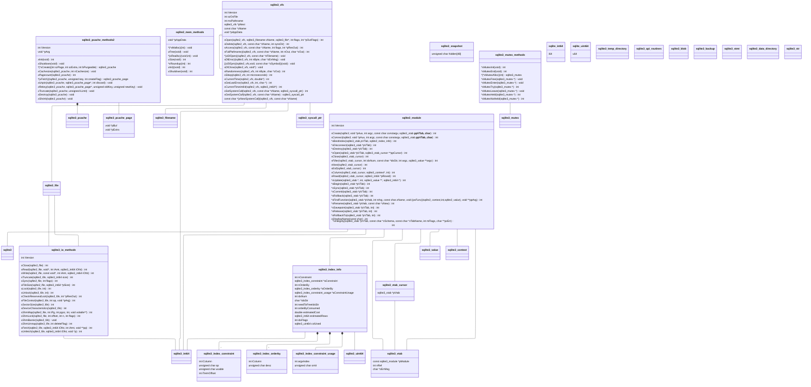

# EpilogLite C/C++ Interface

```mermaid
---
config:
  layout: elk
---
classDiagram
	class sqlite3
	
	class sqlite3_file
	sqlite3_file -- sqlite3_io_methods

	class sqlite3_io_methods {
		int iVersion
  		*xClose(sqlite3_file*) int
		*xRead(sqlite3_file*, void*, int iAmt, sqlite3_int64 iOfst) int
		*xWrite(sqlite3_file*, const void*, int iAmt, sqlite3_int64 iOfst) int
		*xTruncate(sqlite3_file*, sqlite3_int64 size) int
		*xSync(sqlite3_file*, int flags) int
		*xFileSize(sqlite3_file*, sqlite3_int64 *pSize) int
		*xLock(sqlite3_file*, int) int
		*xUnlock(sqlite3_file*, int) int
		*xCheckReservedLock(sqlite3_file*, int *pResOut) int
		*xFileControl(sqlite3_file*, int op, void *pArg) int
		*xSectorSize(sqlite3_file*) int
		*xDeviceCharacteristics(sqlite3_file*) int
		*xShmMap(sqlite3_file*, int iPg, int pgsz, int, void volatile**) int
		*xShmLock(sqlite3_file*, int offset, int n, int flags) int
		*xShmBarrier(sqlite3_file*) void
		*xShmUnmap(sqlite3_file*, int deleteFlag) int
		*xFetch(sqlite3_file*, sqlite3_int64 iOfst, int iAmt, void **pp) int
		*xUnfetch(sqlite3_file*, sqlite3_int64 iOfst, void *p) int
	}
	sqlite3_io_methods -- sqlite3_file
	sqlite3_io_methods -- sqlite3_int64

	class sqlite3_pcache_methods2 {
		int iVersion
		void *pArg
		*xInit(void*) int
		*xShutdown(void*) void
		*(*xCreate)(int szPage, int szExtra, int bPurgeable) sqlite3_pcache
		*xCachesize(sqlite3_pcache*, int nCachesize) void
		*xPagecount(sqlite3_pcache*) int
		*(*xFetch)(sqlite3_pcache*, unsigned key, int createFlag) sqlite3_pcache_page
		*xUnpin(sqlite3_pcache*, sqlite3_pcache_page*, int discard) void
		*xRekey(sqlite3_pcache*, sqlite3_pcache_page*, unsigned oldKey, unsigned newKey) void
		*xTruncate(sqlite3_pcache*, unsigned iLimit) void
		*xDestroy(sqlite3_pcache*) void
		*xShrink(sqlite3_pcache*) void
	}
	sqlite3_pcache_methods2 *-- sqlite3_pcache
	sqlite3_pcache_methods2 -- sqlite3_pcache_page

	class sqlite3_index_constraint {
		int iColumn
		unsigned char op
		unsigned char usable
		int iTermOffset
	} 

	class   sqlite3_index_orderby {
		int iColumn
		unsigned char desc
	}

	class   sqlite3_index_constraint_usage {
		int argvIndex
		unsigned char omit
	}

	class sqlite3_index_info {
		int nConstraint
		sqlite3_index_constraint *aConstraint
		int nOrderBy
		sqlite3_index_orderby *aOrderBy
		sqlite3_index_constraint_usage *aConstraintUsage
		int idxNum
		char *idxStr
		int needToFreeIdxStr
		int orderByConsumed
		double estimatedCost
		sqlite3_int64 estimatedRows
		int idxFlags
		sqlite3_uint64 colUsed
	}
	sqlite3_index_info *--"*" sqlite3_index_constraint
	sqlite3_index_info *--"*" sqlite3_index_orderby
	sqlite3_index_info *-- sqlite3_index_constraint_usage
	sqlite3_index_info -- sqlite3_int64
	sqlite3_index_info -- sqlite3_uint64

	class sqlite3_mem_methods {
		*(*xMalloc)(int) void
		*xFree(void*) void
		*(*xRealloc)(void*,int) void
		*xSize(void*) int
		*xRoundup(int) int
		*xInit)(void*) int
		*xShutdown(void*) int
		void *pAppData
	}

	class sqlite3_pcache_page {
		void *pBuf
		void *pExtra
	}

	class sqlite3_vfs {
		int iVersion
		int szOsFile
		int mxPathname
		sqlite3_vfs *pNext
		const char *zName
		void *pAppData
		*xOpen(sqlite3_vfs*, sqlite3_filename zName, sqlite3_file*, int flags, int *pOutFlags) int
		*xDelete(sqlite3_vfs*, const char *zName, int syncDir) int
		*xAccess(sqlite3_vfs*, const char *zName, int flags, int *pResOut) int
		*xFullPathname)(sqlite3_vfs*, const char *zName, int nOut, char *zOut) int
		*(*xDlOpen)(sqlite3_vfs*, const char *zFilename) void
		*xDlError)(sqlite3_vfs*, int nByte, char *zErrMsg) void
		(*(*xDlSym)(sqlite3_vfs*,void*, const char *zSymbol))(void) void
		*xDlClose(sqlite3_vfs*, void*) void
		*xRandomness(sqlite3_vfs*, int nByte, char *zOut) int
		*xSleep(sqlite3_vfs*, int microseconds) int
		*xCurrentTime(sqlite3_vfs*, double*) int
		*xGetLastError(sqlite3_vfs*, int, char *) int
		*xCurrentTimeInt64(sqlite3_vfs*, sqlite3_int64*) int
		*xSetSystemCall(sqlite3_vfs*, const char *zName, sqlite3_syscall_ptr) int
		*xGetSystemCall(sqlite3_vfs*, const char *zName) sqlite3_syscall_ptr
		const char *(*xNextSystemCall)(sqlite3_vfs*, const char *zName)
	}
	sqlite3_vfs o-- sqlite3_vfs
	sqlite3_vfs -- sqlite3_filename
	sqlite3_vfs -- sqlite3_file
	sqlite3_vfs -- sqlite3_int64
	sqlite3_vfs -- sqlite3_syscall_ptr

	class sqlite3_module {
		int iVersion
		*xCreate(sqlite3*, void *pAux, int argc, const char *const*argv, sqlite3_vtab **ppVTab, char**) int
		*xConnect(sqlite3*, void *pAux, int argc, const char *const*argv, sqlite3_vtab **ppVTab, char**) int
		*xBestIndex(sqlite3_vtab *pVTab, sqlite3_index_info*) int
		*xDisconnect(sqlite3_vtab *pVTab) int
		*xDestroy(sqlite3_vtab *pVTab) int
		*xOpen(sqlite3_vtab *pVTab, sqlite3_vtab_cursor **ppCursor) int
		*xClose(sqlite3_vtab_cursor*) int
		*xFilter(sqlite3_vtab_cursor*, int idxNum, const char *idxStr, int argc, sqlite3_value **argv) int
		*xNext(sqlite3_vtab_cursor*) int
		*xEof(sqlite3_vtab_cursor*) int
		*xColumn(sqlite3_vtab_cursor*, sqlite3_context*, int) int
		*xRowid(sqlite3_vtab_cursor*, sqlite3_int64 *pRowid) int
		*xUpdate(sqlite3_vtab *, int, sqlite3_value **, sqlite3_int64 *) int
		*xBegin(sqlite3_vtab *pVTab) int
		*xSync(sqlite3_vtab *pVTab) int
		*xCommit(sqlite3_vtab *pVTab) int
		*xRollback(sqlite3_vtab *pVTab) int
		*xFindFunction(sqlite3_vtab *pVtab, int nArg, const char *zName, void (**pxFunc)(sqlite3_context*,int,sqlite3_value**), void **ppArg) int
		*xRename(sqlite3_vtab *pVtab, const char *zNew) int
		*xSavepoint(sqlite3_vtab *pVTab, int) int
		*xRelease(sqlite3_vtab *pVTab, int) int
		*xRollbackTo(sqlite3_vtab *pVTab, int) int
		*xShadowName(const char*) int
		*xIntegrity(sqlite3_vtab *pVTab, const char *zSchema, const char *zTabName, int mFlags, char **pzErr) int
	}
	sqlite3_module -- sqlite3
	sqlite3_module -- sqlite3_vtab
	sqlite3_module -- sqlite3_index_info
	sqlite3_module -- sqlite3_vtab_cursor
	sqlite3_module -- sqlite3_value
	sqlite3_module -- sqlite3_context
	sqlite3_module -- sqlite3_int64

	class sqlite3_snapshot {
  		unsigned char hidden[48]
	}

	class sqlite3_vtab {
		const sqlite3_module *pModule
		int nRef
		char *zErrMsg
	}
	sqlite3_vtab -- sqlite3_module

	class sqlite3_vtab_cursor {
		sqlite3_vtab *pVtab
	}
	sqlite3_vtab_cursor -- sqlite3_vtab

	class sqlite3_mutex_methods {
		*xMutexInit(void) int
		*xMutexEnd(void) int
		*(*xMutexAlloc)(int) sqlite3_mutex
		*xMutexFree(sqlite3_mutex *) void
		*xMutexEnter(sqlite3_mutex *) void
		*xMutexTry(sqlite3_mutex *) int
		*xMutexLeave(sqlite3_mutex *) void
		*xMutexHeld(sqlite3_mutex *) int
		*xMutexNotheld(sqlite3_mutex *) int
	}
	sqlite3_mutex_methods -- sqlite3_mutex

	class sqlite_int64 { i64 }
	class sqlite_uint64 { u64 }
	class sqlite3_pcache
	class sqlite3_temp_directory
	class sqlite3_api_routines
	class sqlite3_filename
	class sqlite3_value
	class sqlite3_blob
	class sqlite3_backup
	class sqlite3_context
	class sqlite3_mutex
	class sqlite3_stmt
	class sqlite3_data_directory
	class sqlite3_str
```
