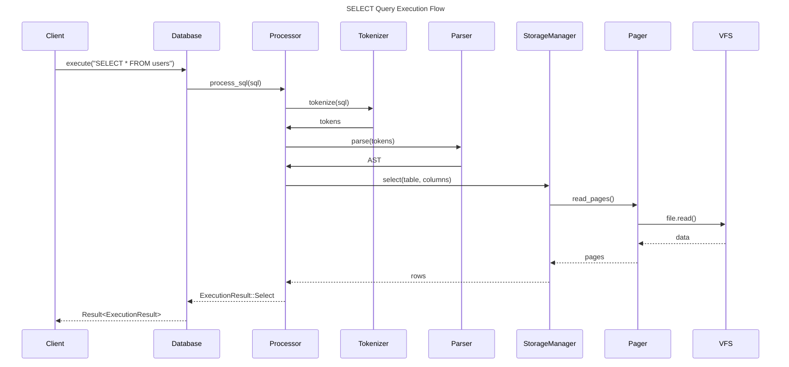
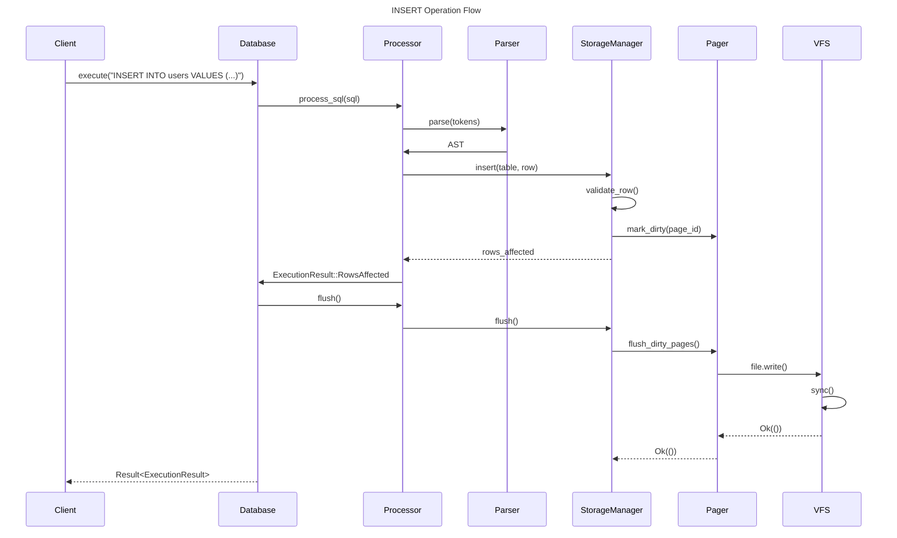
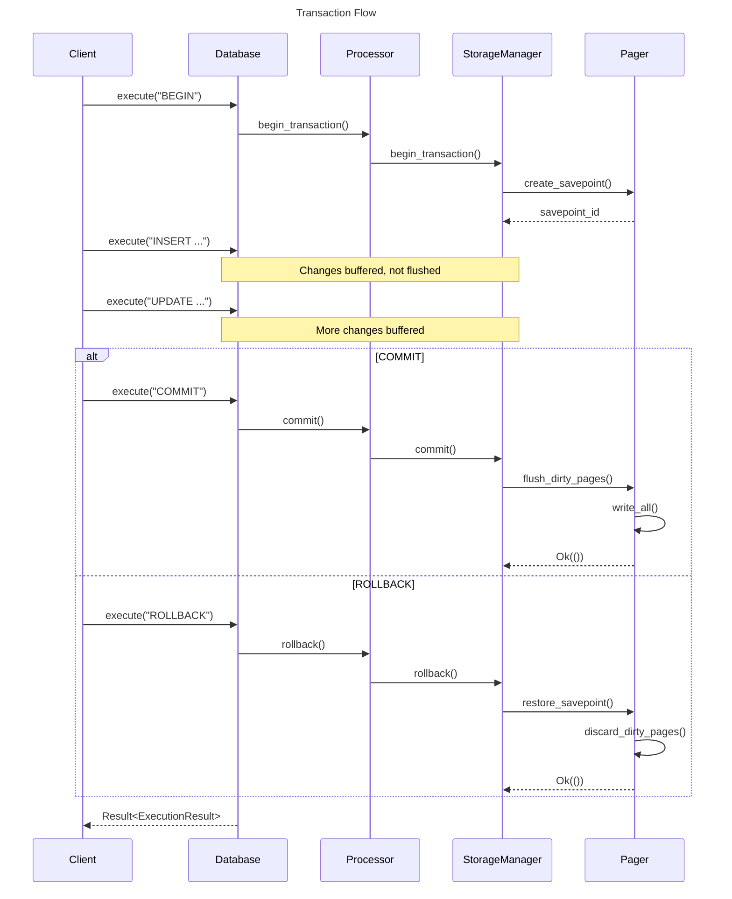
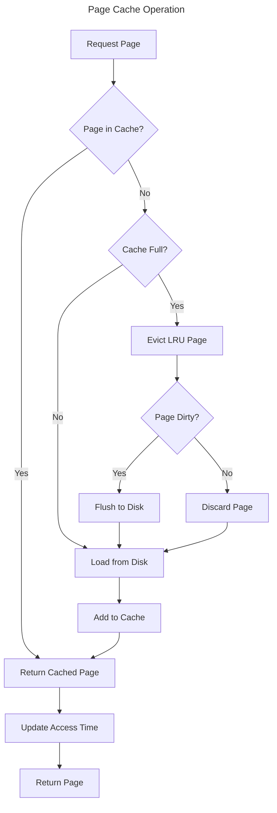
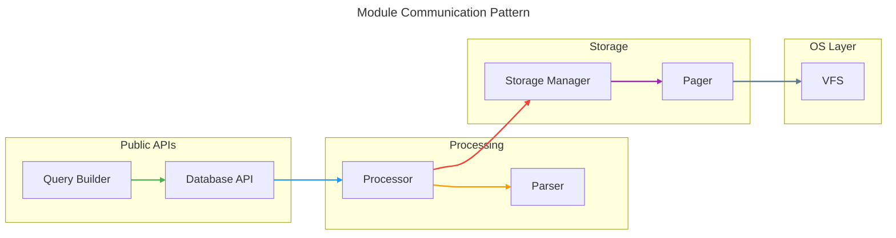
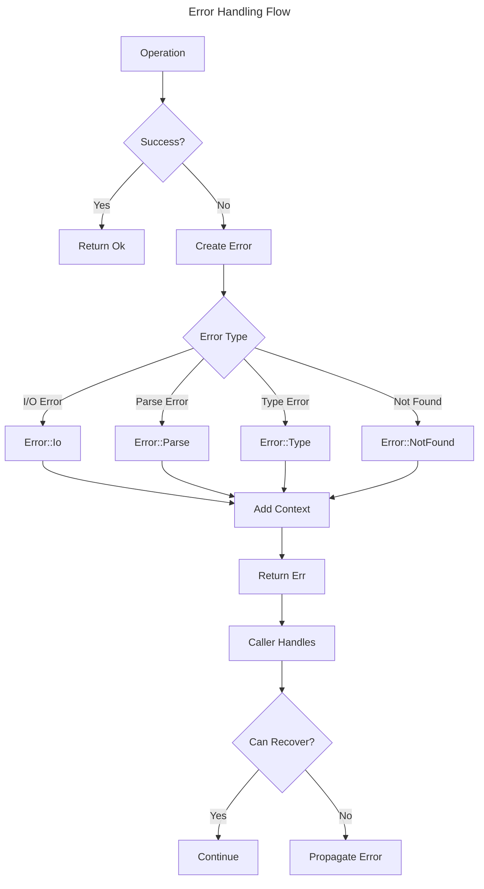

# EpilogLite Data Flow Architecture

## Overview

This document illustrates the flow of data through the EpilogLite system for various operations.

## Query Execution Flow

## Insert Operation Flow

## Transaction Flow

## Page Cache Flow

## Module Communication

## Error Propagation

## Key Design Principles

1. **Unidirectional Dependencies**: Higher layers depend on lower layers, never the reverse
2. **Result Propagation**: All operations return `Result<T, Error>` for explicit error handling
3. **Lazy Loading**: Data loaded from disk only when needed
4. **Write Buffering**: Changes buffered in memory until explicit flush
5. **Cache Management**: LRU-based eviction with dirty page tracking
