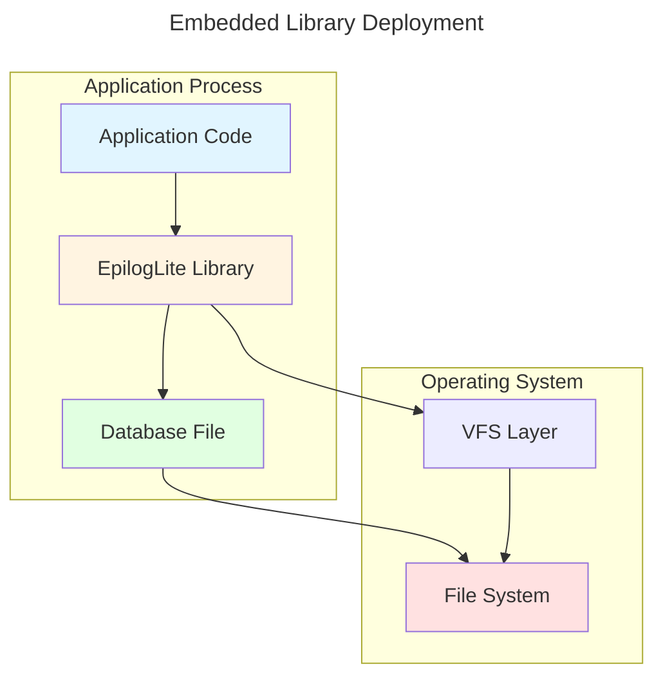
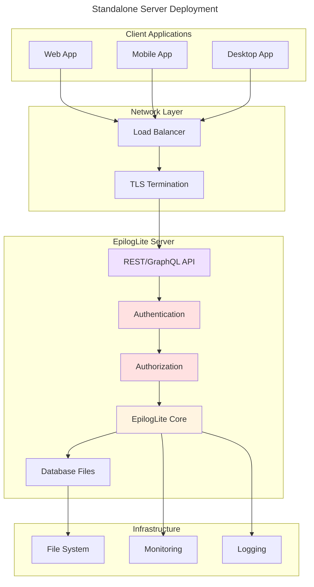
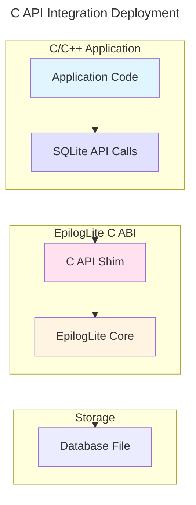
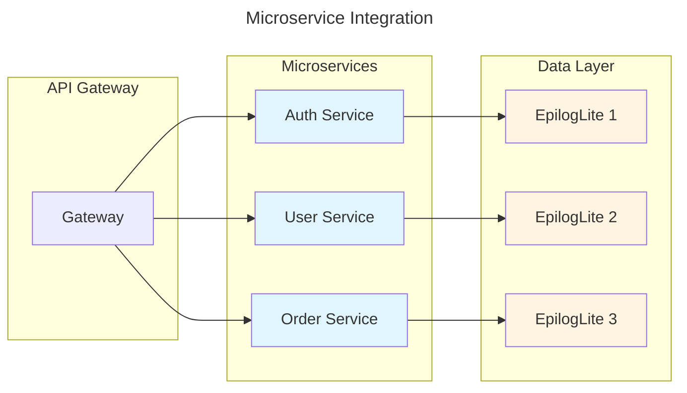
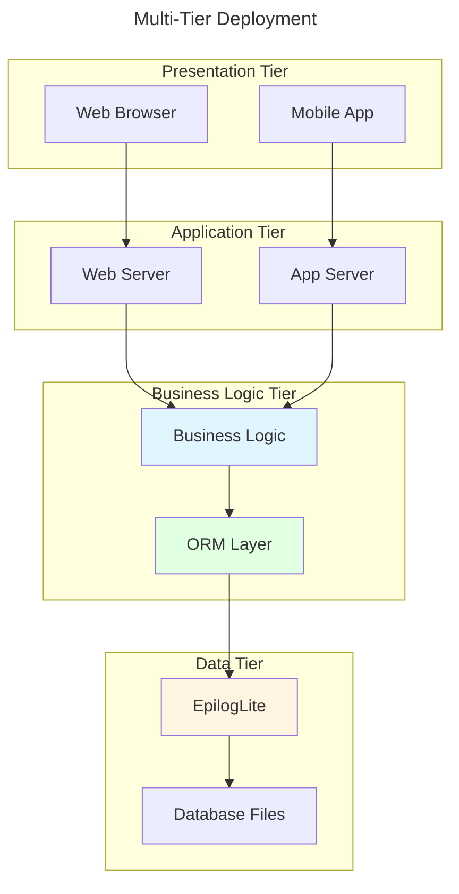
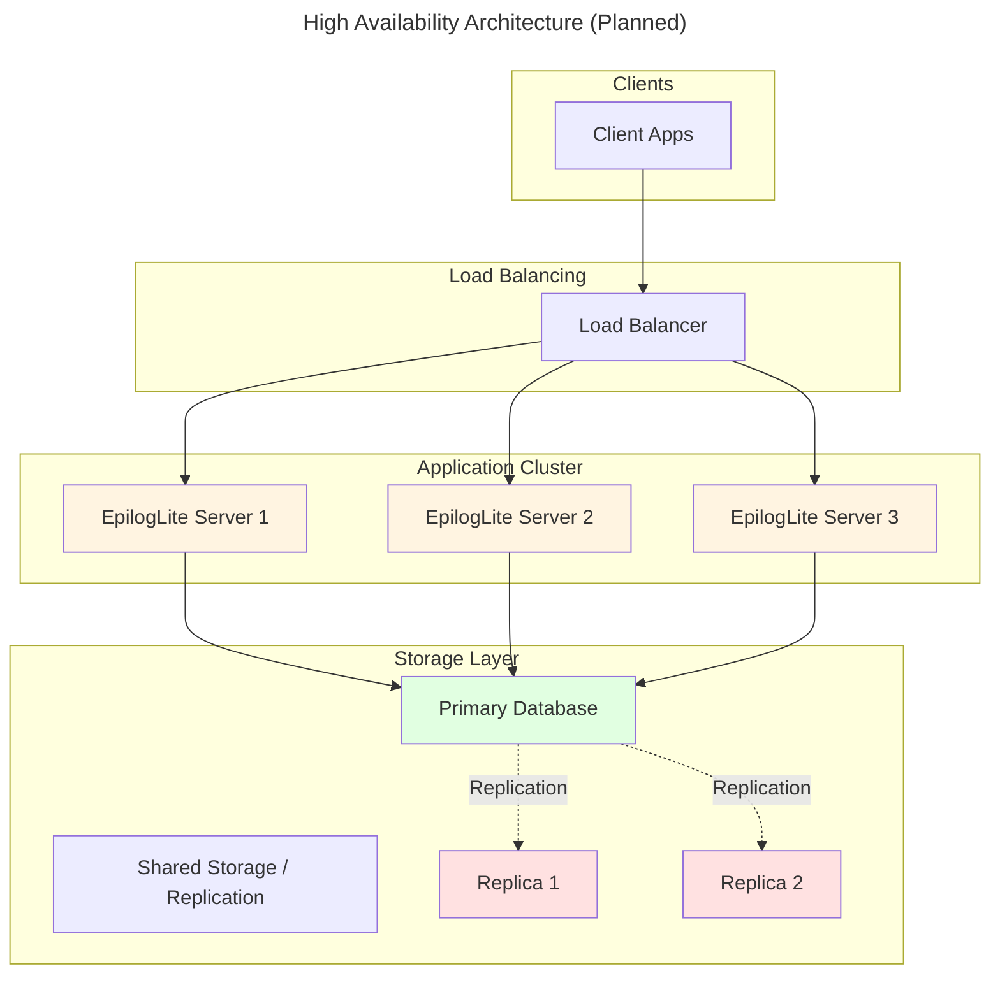

# EpilogLite Deployment Architecture

## Overview

This document describes the various deployment scenarios for EpilogLite and their architectural implications.

## Embedded Library Mode

**Characteristics:**
- EpilogLite compiled into application
- Direct file access via VFS
- Single process access
- Minimal overhead
- Suitable for: desktop apps, CLI tools, mobile apps

## Standalone Server Mode

**Characteristics:**
- EpilogLite as standalone service
- Network API (REST/GraphQL)
- Multi-client access
- Authentication and authorization
- Suitable for: web applications, microservices, multi-user systems

## C API Integration Mode

**Characteristics:**
- Drop-in replacement for SQLite
- C ABI compatibility
- Existing C/C++ code unchanged
- Feature-gated compilation
- Suitable for: legacy applications, C/C++ projects

## Microservice Architecture

**Characteristics:**
- Each microservice has own database
- Database per service pattern
- Embedded library mode per service
- Service isolation
- Suitable for: microservices, distributed systems

## Multi-Tier Architecture

**Characteristics:**
- Clear separation of concerns
- ORM layer for object mapping
- Business logic isolated
- Database abstracted
- Suitable for: enterprise applications, web applications

## High Availability Setup (Planned)

**Characteristics:**
- Multiple server instances
- Load balancing
- Database replication
- Failover capability
- Status: Planned
- Suitable for: mission-critical applications

## Platform Support Matrix

| Platform | Embedded Mode | Server Mode | C API Mode | Status |
|----------|--------------|-------------|------------|--------|
| Linux x86_64 | ✅ | ✅ | ✅ | Production |
| Linux ARM64 | ✅ | ✅ | ✅ | Production |
| Windows x64 | ✅ | ✅ | ✅ | Production |
| macOS x64 | ✅ | ✅ | ✅ | Production |
| macOS ARM64 | ✅ | ✅ | ✅ | Production |
| BSD | ✅ | 🚧 | ✅ | Beta |
| Android | ✅ | ❌ | ✅ | Planned |
| iOS | ✅ | ❌ | ✅ | Planned |
| WASM | 🚧 | ❌ | ❌ | Planned |
| Embedded (no-std) | 🚧 | ❌ | ❌ | Planned |

Legend:
- ✅ Fully Supported
- 🚧 In Progress
- ❌ Not Supported

## Deployment Considerations

### Embedded Mode
- **Pros**: Minimal overhead, simple deployment, no network latency
- **Cons**: Single process access, no multi-user support
- **Best For**: Desktop applications, mobile apps, CLI tools

### Server Mode
- **Pros**: Multi-user support, centralized data, remote access
- **Cons**: Network overhead, more complex deployment, requires authentication
- **Best For**: Web applications, multi-client scenarios

### C API Mode
- **Pros**: Drop-in SQLite replacement, existing code compatibility
- **Cons**: C ABI overhead, limited to C features
- **Best For**: Legacy applications, C/C++ projects

### Microservices
- **Pros**: Service isolation, independent scaling, fault isolation
- **Cons**: Multiple databases, eventual consistency challenges
- **Best For**: Distributed systems, cloud-native applications
