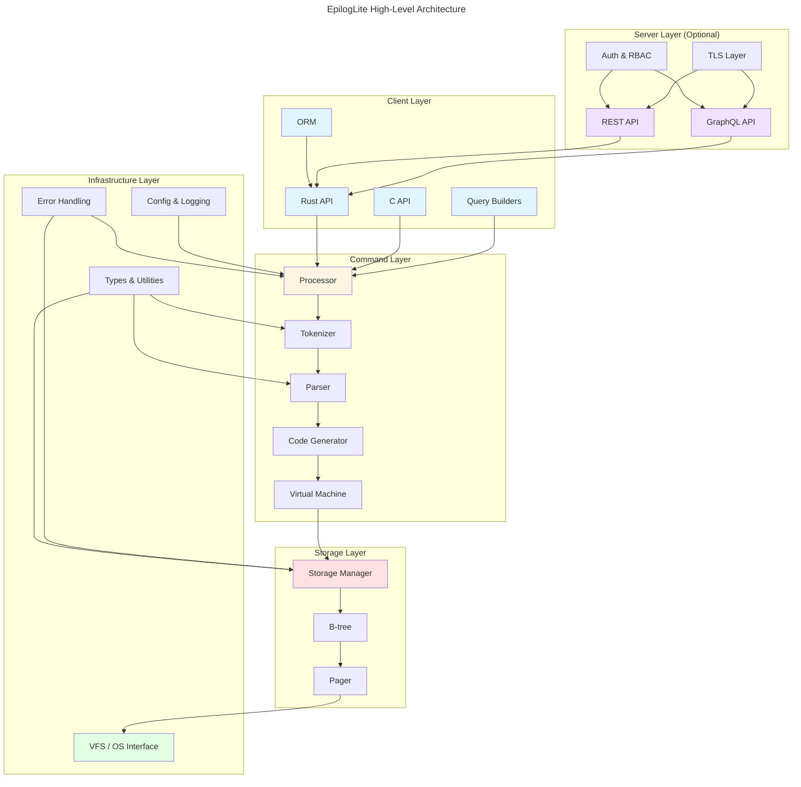

# EpilogLite System Architecture

## Overview

This document provides a high-level overview of the EpilogLite system architecture, showing the major components and their interactions.

## Component Architecture

## Layer Descriptions

### Client Layer
- **Rust API**: Primary public interface for Rust applications
- **C API**: SQLite-compatible C interface for drop-in replacement
- **Query Builders**: Fluent, type-safe query construction
- **ORM**: Entity/Repository pattern for domain object mapping

### Command Layer
- **Tokenizer**: Lexical analysis of SQL text
- **Parser**: Syntax analysis and AST generation
- **Code Generator**: Bytecode generation and query planning
- **Virtual Machine**: Bytecode execution engine
- **Processor**: Coordinates the entire SQL processing pipeline

### Storage Layer
- **Storage Manager**: Table and row management
- **B-tree**: Indexed data structure for efficient access
- **Pager**: Page cache and disk I/O management

### Infrastructure Layer
- **VFS / OS Interface**: Platform abstraction for file I/O, time, random numbers
- **Types & Utilities**: Type system, value handling, utility functions
- **Error Handling**: Comprehensive error types and Result propagation
- **Config & Logging**: Configuration management and structured logging

### Server Layer (Optional)
- **REST API**: HTTP endpoints for SQL execution
- **GraphQL API**: GraphQL schema and resolvers
- **Auth & RBAC**: JWT authentication and role-based authorization
- **TLS Layer**: TLS 1.3 encryption for network security
