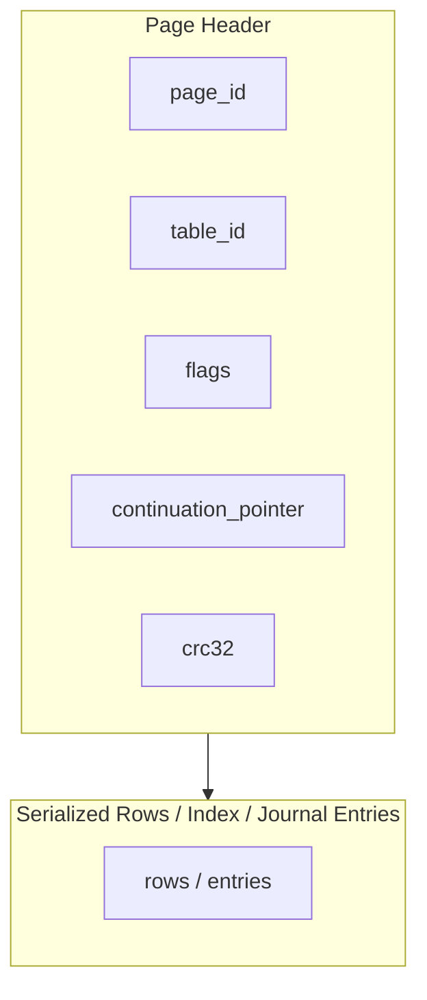
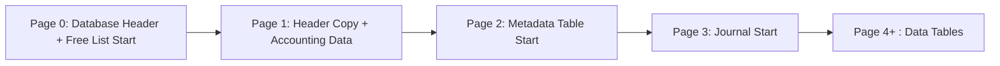
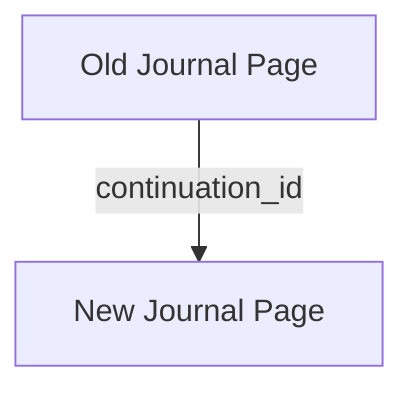
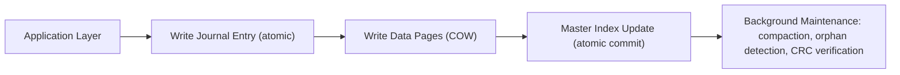

# Rust Paged Database Architecture

This document captures the architecture of a Rust-based local database system inspired by SQLite, emphasizing a uniform page/table abstraction, atomic journaling, and support for variable serialized Rust objects.

---

## 1. Core Concepts

* **Uniform Table Abstraction**: All database entities—including data tables, journal, freelist, metadata, and even the header—are treated as tables with pages and rows.
* **Pages**: Contain serialized rows and a header (`page_id`, `table_id`, `flags`, `continuation_pointer`, `crc32`).
* **Rows**: Serialized Rust objects; supports all native Rust types, `Vec<T>`, `Map<K,V>`, JSON-like structures, nodes/edges, etc.
* **Journal**: A table with reserved `table_id=0`. Supports atomic append of `Before/After` entries. Implements ring buffer semantics.
* **Master Index**: Table mapping logical rows to `(page_id, offset)` pairs; atomic updates provide commit visibility.
* **Free List**: Table tracking free pages, reusable for any table.

---

## 2. Page Layout

**Notes:**

* Continuation pointers link pages in a table chain.
* CRC validates page integrity.
* Slot/index structures are optional for consistency and recovery; offsets can be derived from serialized rows.

---

## 3. Database High-Level Layout

* Page 0: primary header and start of freelist.
* Page 1: redundant header and accounting data.
* Page 2: metadata table (minimal, strongly typed; no column definitions required).
* Page 3: journal (table 0) implementing ring buffer with atomic commit entries.
* Page 4+: data tables; each table may span multiple pages using `continuation_pointer`.

---

## 4. Journal Append & Continuation

**Atomic append procedure:**

1. Compact last-used journal page (`J_old`) to reclaim dead slots.
2. Allocate a free page (`J_new`) and mark it dirty.
3. Write the new page header.
4. Flush the new page.
5. Write `continuation_id` in `J_old` pointing to `J_new`.
6. Flush `J_old` and update control page atomically.

**Key invariants:**

* Only the last pointer write exposes the new page, ensuring crash-safe atomicity.
* Readers and maintenance processes rely on the continuation chain to detect orphan pages.

---

## 5. Operation Sequence (Mutation)

1. **Journal-first**: append `Before/After` entry.
2. **Page write**: COW pages serialized and flushed; CRC calculated.
3. **Index-last**: update master index slot to point to new `(page, offset)`—commit becomes visible.
4. **Maintenance**: frees orphaned pages, compacts tables, trims journal.

---

## 6. Benefits of Uniform Table Abstraction

* **Simplicity**: all database logic uses the same primitives (`read page`, `write page`, `traverse chain`).
* **Extensibility**: any serializable Rust object can be persisted.
* **Atomicity**: journal + page + index ordering guarantees consistent state at all times.
* **Backend Agnostic**: page operations abstract the storage layer (memory, SSD, network storage).
* **Maintenance Friendly**: orphan detection, compaction, CRC verification, and free list reuse follow the same logic across all tables.

---

This structure yields a clean, maintainable, and resilient database engine capable of handling diverse data types while maintaining atomicity, crash safety, and low write amplification.
