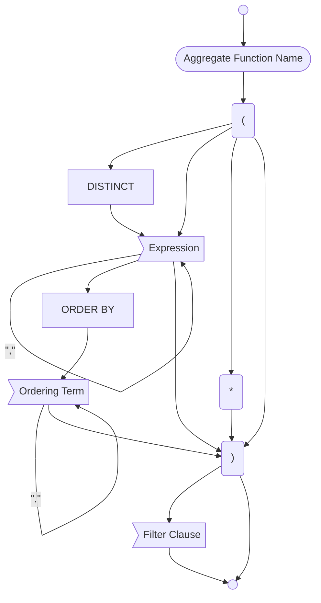

# Aggregate



## Uses

### Statements

### Expressions

### Identifiers

<!-- QueryToSerialize: LIST WITHOUT IDlink(file.name, split(file.path,"/")[length(split(file.path,"/"))-2] + "/" + file.name) FROM "ba-Projects/EpilogLite/sql_syntax" WHERE contains(this.file.statements.expressions,file.name) OR contains(this.file.frontmatter.identifiers,file.name) OR contains(this.file.frontmatter.identifiers,file.name) -->

### Keywords

```dataview
LIST WITHOUT ID Keyword
WHERE file.path = this.file.path
FLATTEN file.frontmatter.keywords AS Keyword
```

### Characters

```dataview
LIST WITHOUT ID "\"" + Character + "\""
WHERE file.path = this.file.path
FLATTEN file.frontmatter.characters AS Character
```

```dataview
LIST WITHOUT ID "x" + char
WHERE char!=null AND file.name = this.file.name
```

## Used by

<!-- QueryToSerialize: TABLE WITHOUT ID split(file.path,"/")[length(split(file.path,"/"))-2] as Type, "[" + split(file.path,"/")[length(split(file.path,"/"))-2] + ": " + file.name + "](<" + replace(file.name," ","%20") + ">)" AS Element FROM "ba-Projects/EpilogLite/sql_syntax" WHERE contains(expressions, this.file.name) -->
<!-- SerializedQuery: TABLE WITHOUT ID split(file.path,"/")[length(split(file.path,"/"))-2] as Type, "[" + split(file.path,"/")[length(split(file.path,"/"))-2] + ": " + file.name + "](<" + replace(file.name," ","%20") + ">)" AS Element FROM "ba-Projects/EpilogLite/sql_syntax" WHERE contains(expressions, this.file.name) -->

| Type | Element |
| ---- | ------- |
<!-- SerializedQuery END -->
