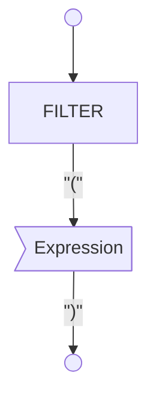

# Filter Clause



## Used by

```dataview
TABLE WITHOUT ID
	split(file.path,"/")[length(split(file.path,"/"))-2] as Type,
	file.link AS Element
FROM "ba-Projects/EpilogLite/sql_syntax" 
WHERE contains(expressions, this.file.name)
```
