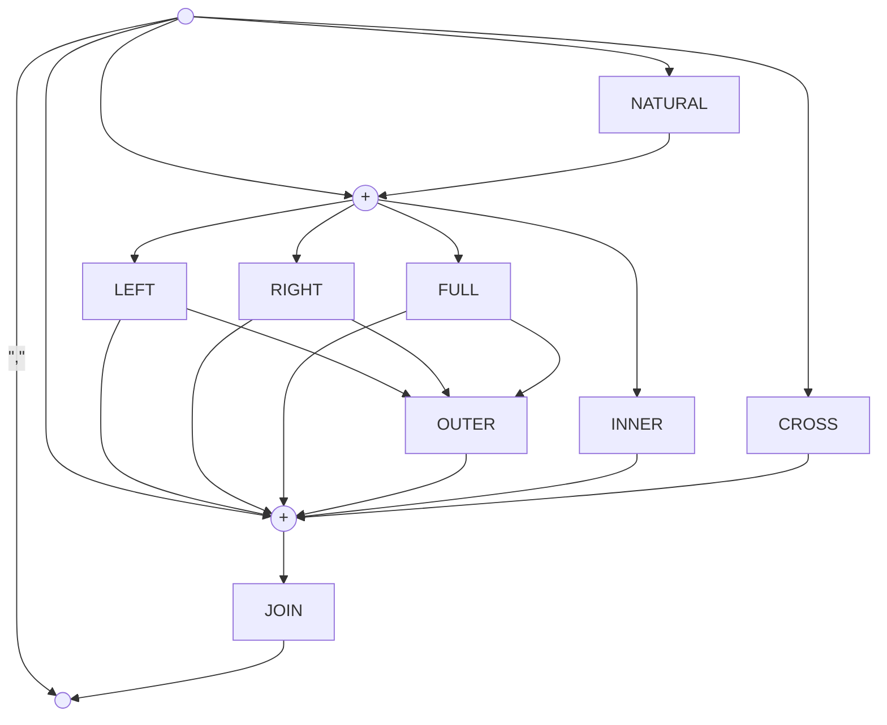

# Join Operator

## Used by

<!-- QueryToSerialize: TABLE WITHOUT ID split(file.path,"/")[length(split(file.path,"/"))-2] as Type, "[" + split(file.path,"/")[length(split(file.path,"/"))-2] + ": " + file.name + "](<" + replace(file.name," ","%20") + ">)" AS Element FROM "ba-Projects/EpilogLite/sql_syntax" WHERE contains(expressions, this.file.name) -->
<!-- SerializedQuery: TABLE WITHOUT ID split(file.path,"/")[length(split(file.path,"/"))-2] as Type, "[" + split(file.path,"/")[length(split(file.path,"/"))-2] + ": " + file.name + "](<" + replace(file.name," ","%20") + ">)" AS Element FROM "ba-Projects/EpilogLite/sql_syntax" WHERE contains(expressions, this.file.name) -->

| Type        | Element                                     |
| ----------- | ------------------------------------------- |
| Expressions | [Expressions: Join Clause](<Join%20Clause>) |
<!-- SerializedQuery END -->
