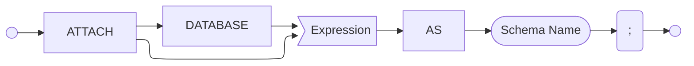

# ATTACH

```mermaid
---
config:
  layout: elk
---
graph LR
	st(( ))
	semi(;)
	stop(( ))
	semi --> stop
	st --> ATTACH
	ATTACH --> DATABASE
	ATTACH --> expression>Expression]
	DATABASE --> expression
	expression --> AS
	AS --> schema_name([Schema Name])
	schema_name --> semi
```
