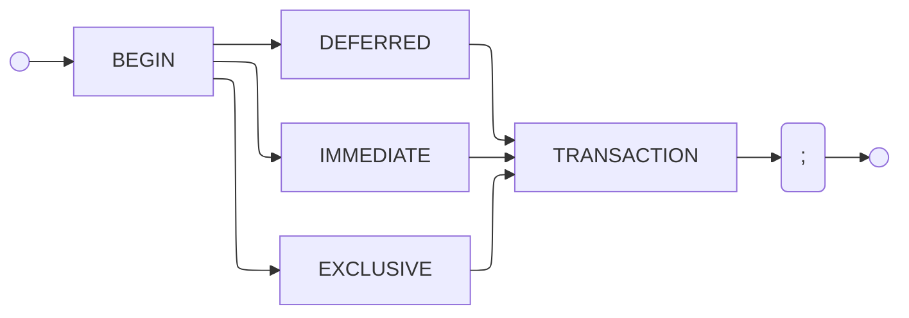

# BEGIN TRANSACTION

```mermaid
---
config:
  layout: elk
---
graph LR
	st(( ))
	semi(;)
	stop(( ))
	semi --> stop
	st --> BEGIN
	BEGIN --> DEFERRED
	BEGIN --> IMMEDIATE
	BEGIN --> EXCLUSIVE
	DEFERRED --> TRANSACTION
	IMMEDIATE --> TRANSACTION
	EXCLUSIVE --> TRANSACTION
	TRANSACTION --> semi
```
