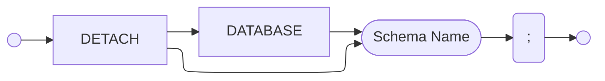

# DETACH

```mermaid
---
config:
  layout: elk
---
graph LR
	st(( ))
	semi(;)
	stop(( ))
	semi --> stop
	st --> DETACH
	DETACH --> DATABASE
	DETACH --> schema_name([Schema Name])
	DATABASE --> schema_name
	schema_name --> semi
```
