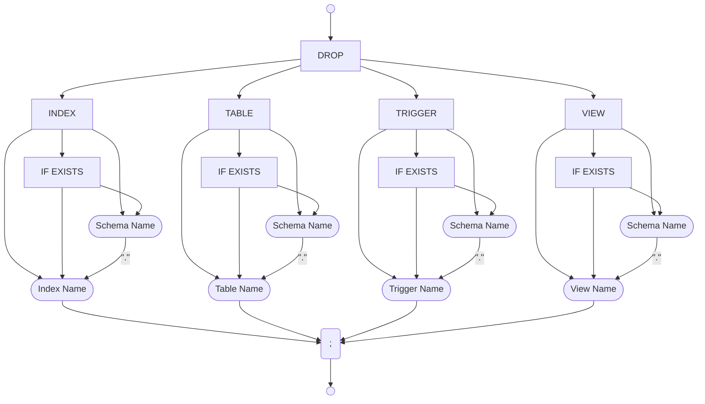

# DROP

```mermaid
graph TB
	st(( ))
	semi(;)
	stop(( ))
	semi --> stop
	
	st --> DROP
	
	DROP --> INDEX
	INDEX --> index_exists[IF EXISTS]
	INDEX --> index_schema_name([Schema Name])
	INDEX --> index_name([Index Name])
	index_exists --> index_schema_name
	index_exists --> index_name
	index_schema_name -->|#quot;.#quot;| index_name
	index_name --> semi
				
	DROP --> TABLE
	TABLE --> table_exists[IF EXISTS]
	TABLE --> table_schema_name([Schema Name])
	TABLE --> table_name([Table Name])
	table_exists --> table_schema_name
	table_exists --> table_name
	table_schema_name -->|#quot;.#quot;|table_name
	table_name --> semi
		
	DROP --> TRIGGER
	TRIGGER --> trigger_exists[IF EXISTS]
	TRIGGER --> trigger_schema_name([Schema Name])
	TRIGGER --> trigger_name([Trigger Name])
	trigger_exists --> trigger_schema_name
	trigger_exists --> trigger_name
	trigger_schema_name -->|#quot;.#quot;| trigger_name
	trigger_name --> semi
				
	DROP --> VIEW
	VIEW --> view_exists[IF EXISTS]
	VIEW --> view_schema_name([Schema Name])
	VIEW --> view_name([View Name])
	view_exists --> view_schema_name
	view_exists --> view_name
	view_schema_name -->|#quot;.#quot;| view_name
	view_name --> semi
```
