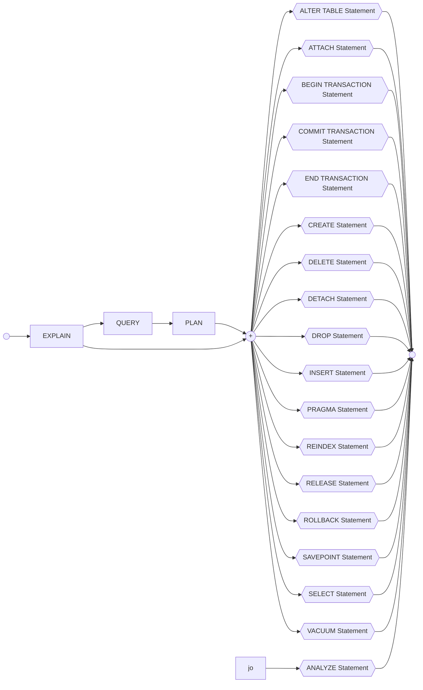

# EXPLAIN

```mermaid
graph LR
	st(( ))
	stop(( ))
	
	st --> EXPLAIN
	EXPLAIN --> QUERY
	EXPLAIN --> j0((+))
	QUERY --> PLAN
	PLAN --> j0
	j0 --> alter_table_statement{{ALTER TABLE Statement}}
	jo --> analyze_statement{{ANALYZE Statement}}
	j0 --> attach_statement{{ATTACH Statement}}
	j0 --> begin_transaction_statement{{BEGIN TRANSACTION Statement}}
	j0 --> commit_transaction_statement{{COMMIT TRANSACTION Statement}}
	j0 --> end_transaction_statement{{END TRANSACTION Statement}}
	j0 --> create_statement{{CREATE Statement}}
	j0 --> delete_statement{{DELETE Statement}}
	j0 --> detach_statement{{DETACH Statement}}
	j0 --> drop_statement{{DROP Statement}}
	j0 --> insert_statement{{INSERT Statement}}
	j0 --> pragma_statement{{PRAGMA Statement}}
	j0 --> reindex_statement{{REINDEX Statement}}
	j0 --> release_statement{{RELEASE Statement}}
	j0 --> rollback_transaction_statement{{ROLLBACK Statement}}
	j0 --> savepoint_statement{{SAVEPOINT Statement}}
	j0 --> select_statement{{SELECT Statement}}
	j0 --> vacuum_statement{{VACUUM Statement}}
	alter_table_statement --> stop
	analyze_statement --> stop
	attach_statement --> stop
	begin_transaction_statement --> stop
	commit_transaction_statement --> stop
	end_transaction_statement --> stop
	create_statement --> stop
	delete_statement --> stop
	detach_statement --> stop
	drop_statement --> stop
	insert_statement --> stop
	pragma_statement --> stop
	reindex_statement --> stop
	release_statement --> stop
	rollback_transaction_statement --> stop
	savepoint_statement --> stop
	select_statement --> stop
	vacuum_statement --> stop
```
