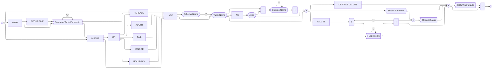

# INSERT

```mermaid
---
config:
  layout: elk
---
graph LR
	st(( ))
	semi(;)
	stop(( ))
	semi --> stop
	
	st --> WITH
	st --> REPLACE
	st --> INSERT
	
	WITH --> RECURSIVE
	WITH --> common_table_expression>Common Table Expression]
	RECURSIVE --> common_table_expression
	common_table_expression -->|#quot;,#quot;| common_table_expression
	common_table_expression --> REPLACE
	common_table_expression --> INSERT
	
	REPLACE --> INTO
	INSERT --> INTO
	INSERT --> OR
	OR --> ABORT
	OR --> FAIL
	OR --> IGNORE
	OR --> REPLACE
	OR --> ROLLBACK
	ABORT --> INTO
	FAIL --> INTO
	IGNORE --> INTO
	ROLLBACK --> INTO
	
	INTO --> schema_name([Schema Name])
	INTO --> table_name([Table Name])
	schema_name -->|#quot;.#quot;| table_name
	
	table_name --> AS
	table_name --> column_lparen("(")
	table_name --> j0((+))
	
	AS --> alias([Alias])
	alias --> column_lparen("(")
	alias --> j0
			
	column_lparen --> column_name([Column Name])
	column_name -->|#quot;,#quot;| column_name
	column_name --> column_rparen(")")
	column_rparen --> j0

	j0 --> VALUES
	j0 --> select_statement{{Select Statement}}
	j0 --> default_clause[DEFAULT VALUES]

	VALUES --> values_lparen("(")
	values_lparen --> expression>Expression]
	expression -->|#quot;,#quot;| expression
	expression --> values_rparen(")")
	values_rparen -->|#quot;,#quot;| values_lparen
	values_rparen --> j1((+))
	values_rparen --> j2((+))
		
	j1 --> upsert_clause>Upsert Clause]
	upsert_clause --> j2

	select_statement --> j1
	select_statement --> j2

	j2 --> returning_clause>Returning Clause]
	j2 --> semi
		
	default_clause --> j2
	

	returning_clause --> semi
```
