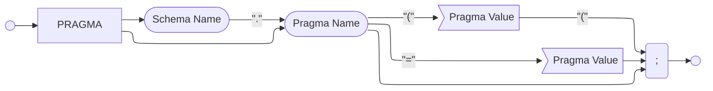

# PRAGMA

```mermaid
---
config:
  layout: elk
---
graph LR
	st(( ))
	semi(;)
	stop(( ))
	semi --> stop
	
	st --> PRAGMA
	PRAGMA --> schema_name([Schema Name])
	PRAGMA --> pragma_name([Pragma Name])
	schema_name -->|#quot;.#quot;| pragma_name
	pragma_name --> semi
	pragma_name -->|#quot;=#quot;| equal_pragma_value>Pragma Value]
	pragma_name -->|"#quot;(#quot;"| paren_pragma_value>Pragma Value]
	equal_pragma_value --> semi
	paren_pragma_value -->|"#quot;(#quot;"| semi 
```
