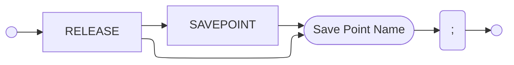

# RELEASE

```mermaid
---
config:
  layout: elk
---
graph LR
	st(( ))
	semi(;)
	stop(( ))
	semi --> stop
	
	st --> RELEASE
	RELEASE --> SAVEPOINT
	RELEASE --> savepoint_name([Save Point Name])
	SAVEPOINT --> savepoint_name
	savepoint_name --> semi
```
