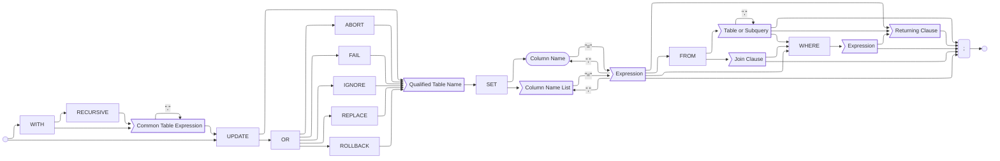

# UPDATE

```mermaid
---
config:
  layout: elk
---
graph LR
	st(( ))
	semi(;)
	stop(( ))
	semi --> stop
	
	st --> WITH
	st --> UPDATE
	
	WITH --> RECURSIVE
	WITH --> common_table_expression>Common Table Expression]
	RECURSIVE --> common_table_expression
	common_table_expression -->|#quot;,#quot;| common_table_expression
	common_table_expression --> UPDATE
	
	UPDATE --> qualified_table_name>Qualified Table Name]
	UPDATE --> OR
	OR --> ABORT
	OR --> FAIL
	OR --> IGNORE
	OR --> REPLACE
	OR --> ROLLBACK
	ABORT --> qualified_table_name
	FAIL --> qualified_table_name
	IGNORE --> qualified_table_name
	REPLACE --> qualified_table_name
	ROLLBACK --> qualified_table_name
	qualified_table_name --> SET
	
	SET --> column_name([Column Name])
	SET --> column_name_list>Column Name List]
	
	column_name -->|#quot;=#quot;| column_expression>Expression]
	column_name_list --> |#quot;=#quot;| column_expression
	
	column_expression -->|#quot;,#quot;| column_name
	column_expression -->|#quot;,#quot;| column_name_list
	column_expression --> FROM
	column_expression --> WHERE
	column_expression --> returning_clause>Returning Clause]
	column_expression --> semi
	
	FROM --> table_or_subquery>Table or Subquery]
	FROM --> join_clause>Join Clause]
	
	table_or_subquery -->|#quot;,#quot;| table_or_subquery
	table_or_subquery --> WHERE
	table_or_subquery --> returning_clause
	table_or_subquery --> semi
		
	join_clause --> WHERE
	join_clause --> semi
	
	WHERE --> where_expression>Expression]
	where_expression --> returning_clause
	where_expression --> semi
	
	returning_clause --> semi
```
