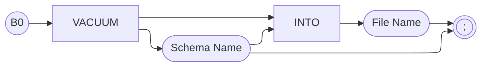

# VACUUM

```mermaid
---
config:
  layout: elk
---
graph LR
	st(("B0"))
	semi(((";")))
	st --> VACUUM
	VACUUM --> schema_name([Schema Name])
	VACUUM --> INTO
	schema_name --> INTO
	schema_name --> semi
	INTO --> file_name([File Name])
	file_name --> semi
```
